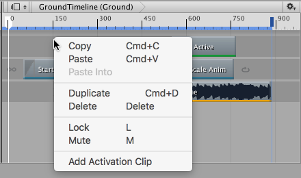

### 添加剪辑

Timeline Editor 窗口支持根据轨道的类型采用不同方法将剪辑添加到轨道。

最快的方法是右键单击轨道中的空白区域，然后从上下文菜单中选择相应的 Add 选项。根据轨道不同，添加剪辑的选项也会发生变化。剪辑会添加到轨道上的最后一个剪辑之后。

还可以将动画剪辑拖动到 Timeline Editor 窗口中的空白区域，从而自动创建轨道并将动画剪辑添加到轨道中。

----

* 2017-08-10  Page published with limited [editorial review](DocumentationEditorialReview.html)

