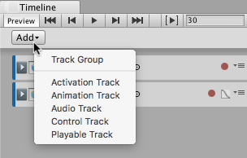

### 添加轨道

Timeline Editor 窗口支持采用多种不同方法将轨道添加到轨道列表。选择的方法将影响游戏对象、轨道绑定和组件。

添加轨道的最简单方法是单击 Add 按钮，然后从 Add Track 菜单中选择轨道类型。还可以右键单击轨道列表的空白区域，然后从 Add Track 菜单中选择轨道类型。

Timeline Editor 窗口也支持将游戏对象拖动到轨道列表中。将游戏对象拖动到轨道列表中的空白区域，然后从上下文菜单中选择要添加的轨道类型。根据所选轨道的类型，Timeline Editor 窗口将执行不同的操作：

* 选择动画轨道，Timeline Editor 会将游戏对象绑定到动画轨道。如果游戏对象还没有动画器组件，则 Timeline Editor 会为游戏对象创建一个动画器组件。

* 选择激活轨道，Timeline Editor 会将游戏对象绑定到激活轨道。在拖动游戏对象来创建激活轨道时存在一些限制。例如，具有 Playable Director 组件的主游戏对象不应绑定到激活轨道。由于正是该游戏对象负责将时间轴资源链接到场景，因此激活和禁用该游戏对象会影响时间轴实例的长度。

* 选择音频轨道，Timeline Editor 会将一个音频源组件添加到游戏对象，并将此音频源组件绑定到音频轨道。

---
* 2017-08-10  Page published with limited [editorial review](DocumentationEditorialReview.html)

