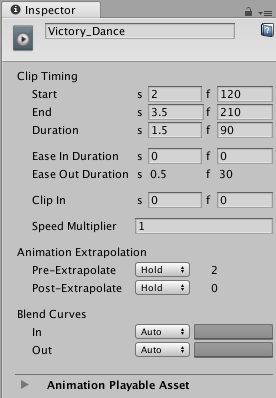

# 动画剪辑公共属性

使用 Inspector 窗口可更改动画剪辑的公共属性。动画剪辑的公共属性包括其名称、时间、播放速度、混合属性以及外推设置。

## 显示名称

Timeline Editor 窗口中显示的动画剪辑的名称。

## Clip Timing 属性

使用 **Clip Timing** 属性可进行修剪，更改持续时间，更改缓入和缓出持续时间或外推，以及调整动画剪辑的播放速度。

以下大多数时间属性以秒 (s) 和帧 (f) 表示。指定以秒修改 **Clip Timing** 属性时，所有十进制值均可接受。指定帧时，仅接受整数值。例如，如果尝试在帧 (f) 字段中输入12.5，则会将其设置为 12 帧。

|**属性：** |**功能：** |
|:---|:---|
|__Start__| 剪辑开始的帧或时间（以秒为单位）。更改 Start 属性会更改时间轴资源中的剪辑轨道上的剪辑位置。更改 Start 属性也可能会影响 Duration 属性。 |
|__End__ | 剪辑结束的帧或时间（以秒为单位）。更改 End 属性会影响 Duration 属性。所有剪辑都使用 End 属性。 |
|__Duration__ | 剪辑的持续时间（以帧或秒为单位）。更改 Duration 属性也会影响 End 属性。 |
|__Ease In Duration__ | 设置剪辑缓入所需的秒数或帧数。如果剪辑的开头与另一个剪辑发生重叠和混合，则无法编辑 Ease In Duration，而是显示剪辑之间混合的持续时间。请参阅[混合剪辑](TimelineBlendingClips.html)。 |
|__Ease Out Duration__ | 设置剪辑缓出所需的秒数或帧数。如果剪辑的结尾与另一个剪辑发生重叠和混合，则无法编辑 Ease Out Duration，而是显示剪辑之间混合的持续时间。在这种情况下，请修剪或定位剪辑以更改剪辑之间混合的持续时间。请参阅[混合剪辑](TimelineBlendingClips.html)。 |
|__Clip In__ | 设置源剪辑开始播放的偏移。例如，要播放 30 秒音频剪辑的最后 10 秒，请将 Clip In 设置为 20 秒。 |
|__Speed Multiplier__ | 剪辑回放速度的乘数。此值必须大于 0。更改剪辑的此值将更改剪辑播放同一内容的持续时间。 |

## Animation Extrapolation

使用 **Animation Extrapolation** 属性可设置动画剪辑前后的空白外推。术语**空白外推**是指动画轨道如何在轨道上的动画剪辑之前、之间和之后的空白位置接近或延长动画数据。

只有动画剪辑才使用 **Animation Extrapolation** 属性。有两个属性可用于在动画剪辑之间[设置空白外推](TimelineGapExtrapolation.html)。

|**属性：** |**功能：** |
|:---|:---|
|__Pre-Extrapolate__| 控制如何在动画剪辑之前的空白位置接近动画数据。Pre-Extrapolate 属性会影响动画剪辑的缓入。 |
|__Post-Extrapolate__ | 控制如何在动画剪辑之后的空白位置延长动画数据。Post-Extrapolate 属性会影响动画剪辑的缓出。 |

## Blend Curves

在两个动画剪辑之间进行混合时，使用 **Blend Curves** 可自定义传出剪辑与传入剪辑之间的过渡。有关如何混合剪辑以及如何自定义混合曲线的详细信息，请参阅[混合剪辑](TimelineBlendingClips.html)。

当[缓入或缓出剪辑](TimelineEasingClips.html)时，**Blend Curves** 可用于自定义缓入剪辑的曲线和缓出剪辑的曲线。

---
* 2017-12-07  Page published with limited [editorial review](DocumentationEditorialReview.html)

