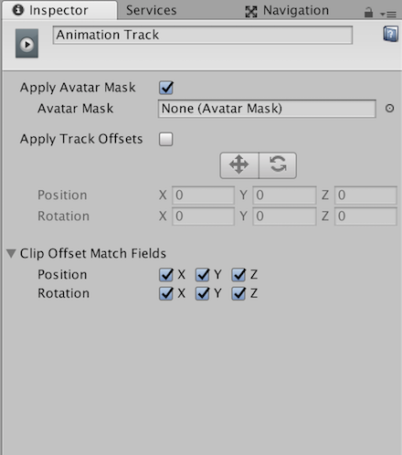

# 动画轨道属性

使用 Inspector 窗口可更改动画轨道的名称，应用化身遮罩，应用轨道偏移，并指定在匹配动画剪辑之间的剪辑偏移时匹配的变换。

|**属性：** |**功能：** |
|:---|:---|
|__显示名称__| 动画轨道在 Timeline Editor 窗口和 Playable Director 组件中的显示名称。显示名称适用于时间轴资源及其所有时间轴实例。只能通过在编辑时间轴实例时选择动画轨道来修改显示名称。 |
|__Apply Avatar Mask__ | 使用此属性可启用化身遮罩。启用后将会根据所选的化身遮罩应用轨道上所有动画剪辑的动画。 |
|&amp;#160;&amp;#160;&amp;#160;&amp;#160;_Avatar Mask_ | 使用此属性可选择应用于动画轨道上所有动画剪辑的化身遮罩 (Avatar Mask)。化身遮罩定义了所选动画轨道上的动画剪辑对哪些人形身体部位进行动画化。被遮罩的身体部位由时间轴资源中的其他动画轨道进行动画化。例如，可以使用化身遮罩[将动画轨道上的下半身动画与覆盖动画轨道上的上半身动画相结合](TimelineWorkflowOverrideMasking.html)。 |
|__Apply Track Offsets__ | 启用 Apply Track Offsets 可将相同的位置和旋转偏移应用于所选动画轨道上的所有动画剪辑。应用轨道偏移有两种方法：在 Scene 视图中使用小辅助图标设置位置和旋转偏移，或指定精确的位置和旋转轨道偏移。 |
|&amp;#160;&amp;#160;&amp;#160;&amp;#160;_Move tool_ | 启用移动工具 (Move tool) 可在 Scene 视图中显示移动辅助图标 (Move Gizmo)。使用移动辅助图标可直观定位轨道偏移。定位移动辅助图标会更改 Position 属性。 |
|&amp;#160;&amp;#160;&amp;#160;&amp;#160;_Rotate tool_ | 启用旋转工具 (Rotate tool) 可在 Scene 视图中显示旋转辅助图标 (Rotate Gizmo)。使用旋转辅助图标可直观旋转轨道偏移。旋转“旋转辅助图标”会更改 Rotation 属性。 |
|&amp;#160;&amp;#160;&amp;#160;&amp;#160;_Position_ | 使用 Position 属性可设置轨道在 X、Y 和 Z 坐标上的偏移。 |
|&amp;#160;&amp;#160;&amp;#160;&amp;#160;_Rotation_ | 使用 Rotation 属性可设置轨道围绕 X、Y 和 Z 轴的旋转偏移。 |
|__Clip Offset Match Fields__ | 展开 Clip Offset Match Fields 可显示一系列复选框，这些复选框用于在动画剪辑之间[匹配剪辑偏移](TimelineMatchOffsets.html)时选择匹配的变换。Clip Offset Match Fields 设置同一轨道上所有动画剪辑的默认匹配选项。使用[动画剪辑可播放资源属性](TimelineAnimationClipPlayableProperties.html)可覆盖每个动画剪辑的这些默认值。 |

---
* 2017-12-07  Page published with limited [editorial review](DocumentationEditorialReview.html)

