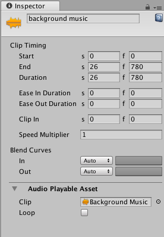

# 音频剪辑属性

使用 Inspector 窗口可更改音频剪辑的属性。这些属性包括剪辑的名称、时间、播放速度、混合属性、音频剪辑使用的音频文件以及音频剪辑是循环播放或播放一次。

## 显示名称

Timeline Editor 窗口中显示的音频剪辑的名称。这不是用于波形的音频文件的名称。音频文件的名称是 **Audio Playable Asset** 属性的一部分。

## Clip Timing 属性

使用 **Clip Timing** 属性可修剪和更改音频剪辑的持续时间。大多数时间属性以秒 (s) 和帧 (f) 表示。指定以秒修改 **Clip Timing** 属性时，所有十进制值均可接受。指定帧时，仅接受整数值。例如，如果尝试在帧 (f) 字段中输入12.5，则会将其设置为 12 帧。

|**属性：** |**功能：** |
|:---|:---|
|__Start__| 剪辑开始的帧或时间（以秒为单位）。更改 Start 属性会更改时间轴资源中的剪辑轨道上的剪辑位置。更改 Start 属性也可能会影响 Duration 属性。所有剪辑都使用 Start 属性。 |
|__End__ | 剪辑结束的帧或时间（以秒为单位）。更改 End 属性会影响 Duration 属性。所有剪辑都使用 End 属性。 |
|__Duration__ | 剪辑的持续时间（以帧或秒为单位）。更改 Duration 属性也会影响 End 属性。所有剪辑都使用 Duration 属性。 |

## Blend Curves

在两个音频剪辑之间进行混合时，使用 **Blend Curves** 可自定义传出剪辑与传入剪辑之间的过渡。有关如何混合剪辑以及如何自定义混合曲线的详细信息，请参阅[混合剪辑](TimelineBlendingClips.html)。

当缓入或缓出剪辑时，**Blend Curves** 可用于自定义缓入音频剪辑的曲线和缓出音频剪辑的曲线。有关详细信息，请参阅[缓入和缓出剪辑](TimelineEasingClips.html)。

## Audio Playable Asset 属性

使用 **Audio Playable Asset** 属性可选择音频剪辑使用的音频文件，并设置所选音频剪辑是循环播放（启用 **Loop**）还是播放一次（禁用 **Loop**）。

---
* 2017-12-07  Page published with limited [editorial review](DocumentationEditorialReview.html)

