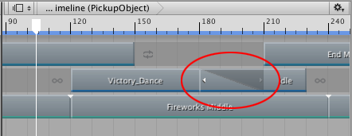

### 混合剪辑

在同一轨道上混合两个剪辑，即可在两个动画剪辑、两个音频剪辑或两个可播放剪辑之间创建平滑过渡。要混合两个剪辑，请定位或修剪一个剪辑，直至其与另一个剪辑重叠。

在混合中，第一个剪辑称为__传出剪辑__，第二个剪辑称为__传入剪辑__。传出剪辑过渡到传入剪辑的区域称为__混合区域__。混合区域决定了过渡的持续时间。

虽然剪辑视图将混合区域表示为单个线性曲线，但剪辑之间的过渡实际上由两条混合曲线组成。传出剪辑的混合曲线称为__混出__曲线。传入剪辑的混合曲线称为__混入__曲线。默认情况下，每条混合曲线都会自动设置为缓入和缓出曲线。

使用 Inspector 窗口中的 __Blend Curves__ 可更改所选剪辑的混入或混出曲线的形状。但是，Inspector 窗口仅允许一次编辑一个剪辑的属性。无法同时自定义来自相同混合区域的两条混合曲线。

要为两个剪辑之间的过渡自定义 __Blend Curves__，请执行以下操作：

1.选择传出剪辑以自定义其混出曲线（标记为 __Out__）。

2.选择传入剪辑以自定义其混入曲线（标记为 __In__）。

要自定义混出曲线或混入曲线，请使用下拉菜单从 __Auto__ 切换到 __Manual__。选择 __Manual__ 后，Inspector 窗口将显示混合曲线的预览。单击预览可在 Inspector 窗口下方打开曲线编辑器 (Curve Editor)。

使用曲线编辑器 (Curve Editor) 可自定义混合曲线的形状。默认情况下，混合曲线包括曲线开头的关键点和曲线末尾的关键点。曲线编辑器 (Curve Editor) 提供了以下修改混合曲线的不同方法：

* 选择在混合曲线开头的关键点，然后使用切线控制柄调整关键点之间的插值。

* 选择在混合曲线末尾的关键点，然后使用切线控制柄调整关键点之间的插值。

* 添加其他关键点以通过添加更多插值点来更改混合曲线的形状。在曲线编辑器 (Curve Editor) 中添加关键点的方法与[在曲线视图中添加关键点](TimelineAddingKeys.html)的方法相同。

* 右键单击某个关键点以删除或编辑该关键点。在曲线编辑器 (Curve Editor) 中编辑关键点的方法与[在曲线视图中编辑关键点](TimelineEditingKeys.html)的方法相同。请注意，无法删除第一个和最后一个关键点。

* 从曲线编辑器 (Curve Editor) 的底部选择一个形状模板。

曲线编辑器 (Curve Editor) 还将根据要修改混入曲线还是混出曲线而包括相应的形状模板。选择形状模板，将混合曲线更改为选定的形状模板。

---
* 2017-08-10  Page published with limited [editorial review](DocumentationEditorialReview.html)

