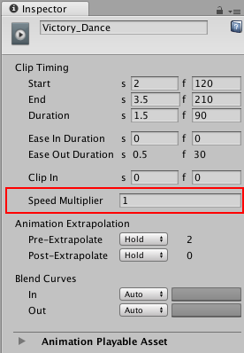
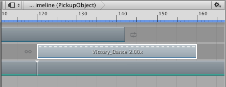

### 更改剪辑播放速度

更改剪辑的播放速度可加速或减慢其音频、动作、动画或粒子效果。更改剪辑播放速度会影响剪辑的持续时间。只能更改动画剪辑、音频剪辑和控制剪辑的播放速度。对于所有其他剪辑类型，速度选项为禁用状态。

在 Inspector 窗口中，__Speed Multiplier__ 属性将播放速度显示为原始剪辑速度的倍数。例如，将 80 帧动画剪辑的播放速度更改为双倍速度会将剪辑持续时间更改为 40 帧，并将 __Speed Multiplier__ 设置为 2。

要更改剪辑播放速度，请右键单击剪辑并选择以下选项之一：

* __Speed > Double Speed__ 可将剪辑持续时间减半。剪辑将以当前速度的两倍速度播放。短虚线和倍增系数表示加速剪辑。将剪辑速度加倍可将 __Speed Multiplier__ 属性设置为其当前值的两倍。

* __Speed > Half Speed__ 可将持续时间翻倍。剪辑将以当前速度的一半速度播放。长虚线和倍增系数表示减速剪辑。将剪辑速度减半可将 __Speed Multiplier__ 属性设置为其当前值的一半。

* __Speed > Reset Speed__ 可将剪辑重置为原始持续时间。剪辑将以其原始速度播放。重置剪辑速度可将 __Speed Multiplier__ 属性设置为 1。

---
* 2017-08-10  Page published with limited [editorial review](DocumentationEditorialReview.html)

