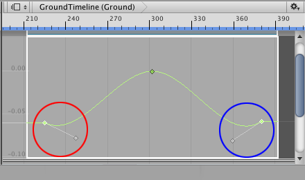
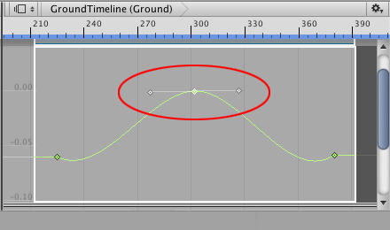
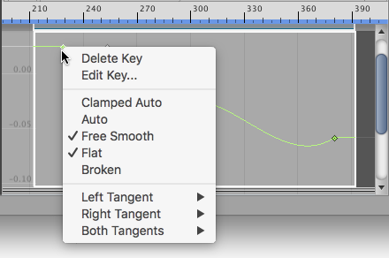

### 更改插值和形状

每个关键点都有一条或两条切线可用于控制动画曲线的插值。术语__插值__是指估算用于确定两个关键点之间动画曲线形状的值。

关键点是否具有两条切线之一取决于关键点在动画曲线上的位置。第一个关键点只有一条右切线，用于控制关键点之后的动画曲线的插值。最后一个关键点只有一条左切线，用于控制最后一个关键点之前的动画曲线的插值。

所有其他关键点都有两条切线，其中左切线控制关键点前的插值，右切线控制关键点后的插值。默认情况下，切线之间是相互连接的。拖动一条切线会影响两条切线的位置以及关键点前后动画曲线的插值。

拖动切线还可能更改动画曲线的插值模式。例如，大多数关键点设置为 Clamped Auto 插值模式，该模式在通过关键点时自动平滑动画曲线。如果拖动关键点设置为 Clamped Auto 的切线，则插值模式将更改为 Free Smooth。

术语__插值模式__是指插值算法，用于确定绘制动画曲线时要使用的形状。

要查看关键点的插值模式，请选择该关键点并单击鼠标右键。上下文菜单将显示插值模式。要更改关键点的插值模式，请选择该关键点，单击鼠标右键并选择其他插值模式。

某些插值模式会断开左右切线，可能使左右切线的位置分开。当切线断开时，可为关键点之前的动画曲线和关键点之后的动画曲线设置单独的插值模式。有关不同插值模式的更多详细信息，请参阅[编辑曲线](EditingCurves.html)。在 [Animation 窗口文档](AnimationEditorGuide.html)中，插值模式称为__切线类型__。

---
* 2017-08-10  Page published with limited [editorial review](DocumentationEditorialReview.html)

