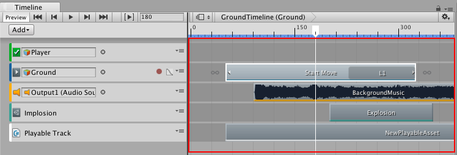

## 剪辑视图

可在剪辑视图的轨道列表中添加、定位和操纵每个轨道的剪辑。在 Timeline Editor 窗口中，如果没有轨道，剪辑便无法存在。

每个剪辑都有一条彩色强调线，用于标识轨道和剪辑的类型。默认情况下，激活剪辑为绿色，动画剪辑为蓝色，音频剪辑为橙色，控制剪辑为青绿色，可播放剪辑为白色。

---
* 2017-08-10  Page published with limited [editorial review](DocumentationEditorialReview.html)

