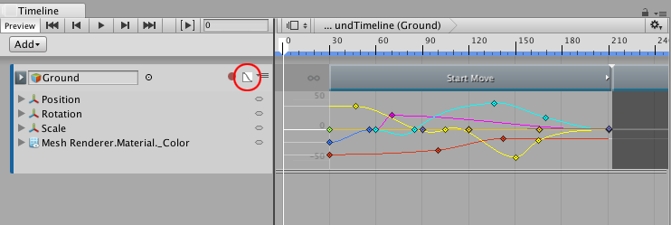
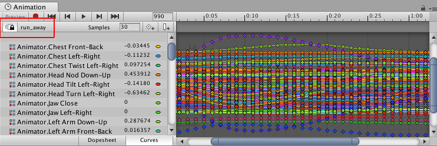

## 曲线视图

曲线视图显示无限剪辑的动画曲线或已从无限剪辑转换的动画剪辑的动画曲线。使用曲线视图可进行基本动画编辑，例如修改现有关键点，添加新关键点，调整切线，以及更改关键点之间的插值。

要查看无限剪辑的动画曲线，请单击轨道名称旁边的曲线图标。要查看动画剪辑的动画曲线，请选择动画剪辑，然后单击曲线图标。曲线视图类似于 Animation 窗口中的[曲线模式](animeditor-AnimationCurves.html)。

具有人形动画或导入动画的动画轨道不会显示曲线图标。要查看和编辑人形动画剪辑或导入动画剪辑的关键动画，请右键单击动画剪辑，然后从上下文菜单中选择 __Edit in Animation Window__。也可以双击动画剪辑。此时将显示链接到 Timeline Editor 窗口的 Animation 窗口。

在链接模式下，Animation 窗口会显示链接图标以及正在编辑的动画剪辑的名称。单击链接图标可停止编辑动画剪辑并从链接模式释放 Animation 窗口。

---
* 2017-08-10  Page published with limited [editorial review](DocumentationEditorialReview.html)

