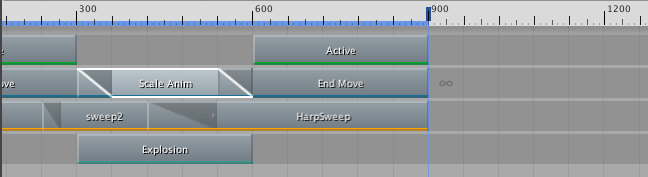
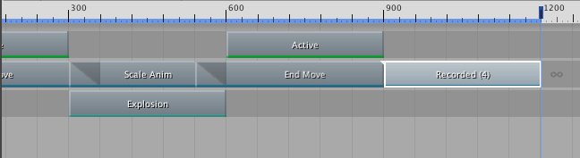
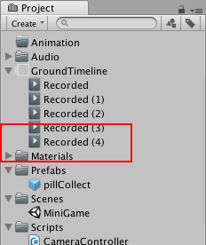

### 复制剪辑

Timeline Editor 窗口支持采用以下不同的方法来复制剪辑：

* 选择一个或多个剪辑。右键单击剪辑视图，然后从上下文菜单中选择 __Duplicate__。

* 选择一个或多个剪辑。按住 Command/Control 并按 D。

* 选择一个或多个剪辑。按住 Command/Control 并按 C 进行复制，按 V 进行粘贴。

* 右键单击剪辑，但不选择，然后从上下文菜单中选择 __Duplicate__。

复制剪辑会复制每个选定的剪辑，并将副本放在其轨道上的最后一个剪辑之后。如果复制混合中使用的剪辑，则会平铺复制的剪辑并删除混合。

如果复制使用录制剪辑作为源资源的动画剪辑，则会创建录制剪辑的副本并将其添加到时间轴资源。只有在保存场景或项目后才会显示录制剪辑的副本。复制的录制剪辑的名称基于原始的录制剪辑。复制的动画剪辑的名称与复制的录制剪辑的名称相同。

---
* 2017-08-10  Page published with limited [editorial review](DocumentationEditorialReview.html)

