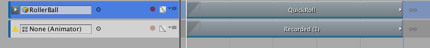

### 复制轨道

Timeline Editor 窗口支持采用以下不同的方法来复制轨道：

* 选择一个轨道。右键单击轨道列表中的空白区域，然后从上下文菜单中选择 __Duplicate__。

* 选择一个轨道。按住 Command/Control 并按 D。

* 选择一个轨道。按住 Command/Control 并按 C 进行复制，按 V 进行粘贴。

* 右键单击轨道，然后从上下文菜单中选择 __Duplicate__，或按住 Command/Control 并按 D。

复制轨道会复制其剪辑、混合和 Inspector 属性。如果复制的轨道绑定到游戏对象，则绑定将重置为 None。

---
* 2017-08-10  Page published with limited [editorial review](DocumentationEditorialReview.html)

