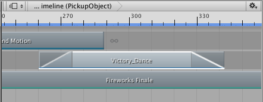
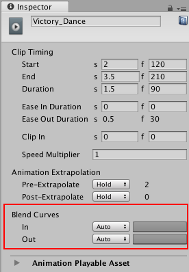
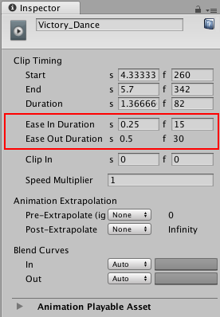
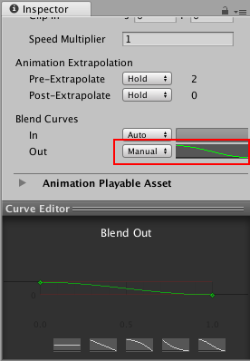
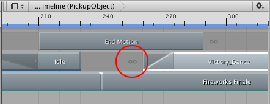
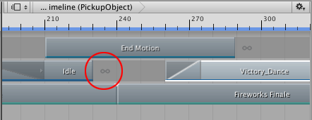
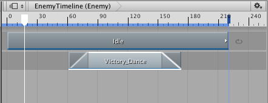
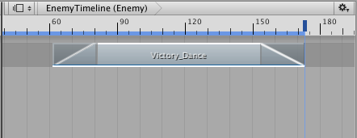

### 缓入和缓出剪辑

缓入和缓出剪辑可在剪辑及其周围空白之间创建一种平滑过渡效果。要创建缓入或缓出过渡，请使用下列方法之一：

* 按住 Control/Command 并将剪辑的开头向右拖动以添加缓入。

* 按住 Control/Command 并将剪辑的结尾向左拖动以添加缓出。

* 选择剪辑，然后在 Inspector 窗口中设置 __Ease In Duration__ 或 __Ease Out Duration__。

缓入或缓出过渡效果根据轨道而不同：

* 在动画轨道或动画覆盖轨道上，缓入动画剪辑可在剪辑之前的空白中的动画与动画剪辑之间创建平滑过渡。缓出动画剪辑可在动画剪辑与剪辑之后的空白中的动画之间创建平滑过渡。在确定动画剪辑前后的空白中出现的动画时，有很多因素。有关详细信息，请参阅[设置空白外推](TimelineGapExtrapolation.html)。

* 在音频轨道上，缓入音频剪辑可淡入音频波形的音量。缓出音频剪辑可淡出音频剪辑指定的音频波形的音量。

* 在可播放轨道上，缓入可播放剪辑可淡入可播放剪辑中的效果或脚本。缓出可播放剪辑可淡出可播放剪辑中的效果或脚本。

虽然剪辑视图将缓入或缓出表示为单个线性曲线，但默认情况下，每个缓入或缓出过渡实际上均设置为逐渐缓入或缓出的曲线。要更改缓入曲线（标记为 In）或缓出曲线（标记为 Out）的形状，请使用 Inspector 窗口中的 Blend Curves 属性。

请注意，__Blend Curves__ 属性可能会影响用于混合两个剪辑的混合区域。__Ease In Duration__ 和 __Ease Out Duration__ 属性表示 __Blend Curves__ 影响缓入、缓出还是混合。例如，如果 __Ease Out Duration__ 属性可编辑，则混出曲线（标记为 __Out__）将影响缓出过渡使用的曲线。如果 __Ease Out Duration__ 属性无法编辑，则混出曲线（标记为 __Out__）将影响两个剪辑之间的混合中的传出剪辑。

要自定义缓入或缓出过渡，请使用下拉菜单从 __Auto__ 切换到 __Manual__。选择 __Manual__ 后，Inspector 窗口将显示混合曲线的预览。单击预览可在 Inspector 窗口下方打开曲线编辑器 (Curve Editor)。

曲线编辑器 (Curve Editor) 与[混合剪辑](TimelineBlendingClips.html)时用于自定义混合曲线形状的编辑器相同。

使用动画剪辑创建缓入或缓出过渡时，动画剪辑会在空白和动画剪辑之间进行混合。以下因素会影响动画剪辑周围空白中的动画属性的值：

* 动画剪辑的和同一轨道上其他动画剪辑的[前外推 (pre-extrapolate) 和后外推 (post-extrapolate) 设置](TimelineGapExtrapolation.html)。

* 绑定到同一游戏对象的其他动画轨道上的动画剪辑。

* 时间轴资源之外的场景游戏对象位置或动画。

#### 空白外推和缓动剪辑

要成功缓入或缓出动画剪辑，不得基于正在缓入或缓出的动画剪辑来设置空白外推。空白外推必须设置为 None，或者必须由另一个动画剪辑设置。

例如，以下缓入无效，因为 Victory_Dance 剪辑的 Pre-Extrapolate 设置为 Hold。这意味着缓入会在动画剪辑的第一帧与动画剪辑的其余帧之间创建过渡。

#### 使用缓入和缓出覆盖动画轨道

如果将空白外推设置为 None，并且前一个轨道绑定到同一游戏对象，则空白中的动画将取自前一个轨道。这对于在不同轨道上的两个动画剪辑之间创建平滑过渡非常有用。

例如，如果两个动画轨道绑定到同一个游戏对象并且第二个轨道上的剪辑包含一个缓入，则该缓入会在前一个轨道上的动画和第二个轨道上的动画之间创建平滑过渡。要成功覆盖前一个轨道上的动画，必须将第二个轨道的空白外推设置为 None。

#### 使用缓入和缓出来覆盖场景

在场景中，如果游戏对象由动画控制器进行控制，则可在动画剪辑和动画控制器之间使用缓入或缓出过渡。

例如，如果时间轴资源包含具有单个动画剪辑的单个轨道，并且其所有空白外推设置均设置为 None，则空白将使用场景中游戏对象的位置或动画。

此位置或动画是场景中设置的游戏对象。如果游戏对象使用动画控制器来控制其动画状态，则空白设置为当前动画状态。例如，如果游戏对象是在场景中行走的角色，则可以将时间轴资源设置为缓入动画以覆盖步行动画状态。缓出根据动画控制器将游戏对象返回到动画状态。

---
* 2017-08-10  Page published with limited [editorial review](DocumentationEditorialReview.html)

