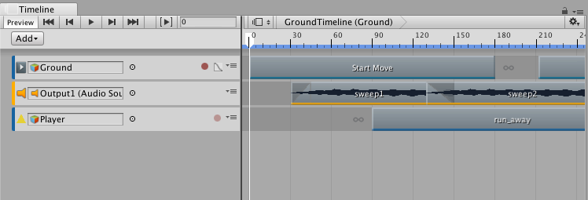
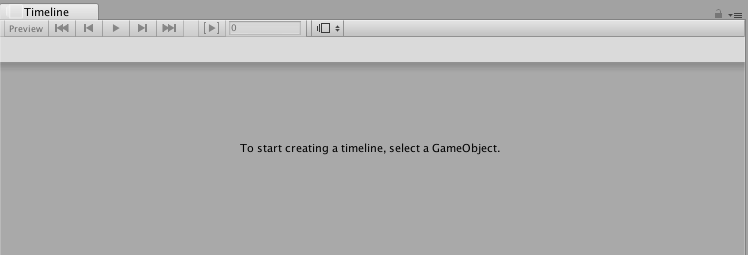
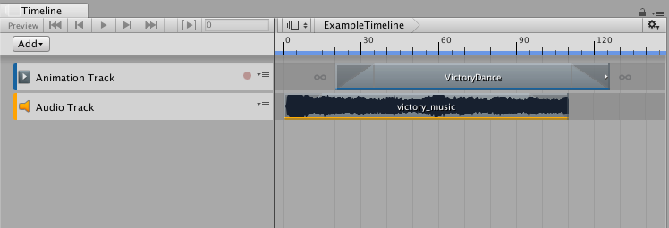

# Timeline Editor 窗口

要访问 Timeline Editor 窗口，请从 Window 菜单中选择 __Timeline Editor__。Timeline Editor 窗口显示的内容取决于 Project 窗口或 Scene 视图中选择的内容。

例如，如果选择与时间轴资源关联的游戏对象，则 Timeline Editor 窗口将显示来自时间轴资源的轨道和剪辑以及来自时间轴实例的游戏对象绑定。

如果尚未选择游戏对象，则 Timeline Editor 窗口会提示创建时间轴资源和时间轴实例的第一步是选择游戏对象。

如果选择了游戏对象，但该游戏对象未与时间轴资源关联，则 Timeline Editor 窗口会提供一个选项来创建新时间轴资源、向所选游戏对象添加必要组件以及创建时间轴实例。

要使用 Timeline Editor 窗口查看以前创建的时间轴资源，请在 Project 窗口中选择时间轴资源，然后打开 Timeline Editor 窗口。Timeline Editor 窗口会显示与时间轴资源关联的轨道和剪辑，但没有与场景中游戏对象的轨道绑定。此外，还会禁用时间轴播放控件，并且没有时间轴播放头。

与场景中游戏对象的轨道绑定不会与时间轴资源一起保存。轨道绑定与时间轴实例一起保存。有关项目、场景、时间轴资源和时间轴实例之间关系的详细信息，请参阅[时间轴概述](TimelineOverview.html)。

---
* 2017-08-10  Page published with limited [editorial review](DocumentationEditorialReview.html)

