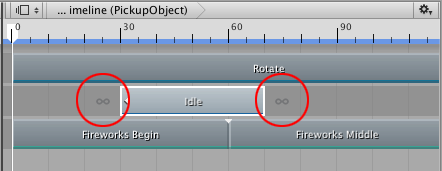
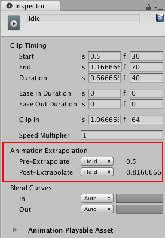
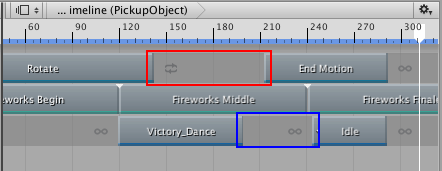

### 设置空白外推

“空白外推”是指动画轨道如何在动画剪辑之前和之后的空白位置接近动画数据。

在动画剪辑之间的空白位置外推动画数据的主要目的是避免动画异常。根据绑定到动画轨道的游戏对象，这些异常可能是游戏对象在两个变换之间跳跃，或者是人形角色在不同姿势之间跳跃。

每个动画剪辑都有两个空白外推：__前外推__用于控制如何在动画剪辑前的空白位置接近动画数据；__后外推__用于控制如何在动画剪辑后的空白位置延伸动画数据。

默认情况下，前外推和后外推设置均设为 Hold。这会将动画剪辑之前的空白设置为停在第一帧上的动画，并将动画剪辑之后的空白设置为停在最后一帧上的动画。动画剪辑前面和后面的图标指示了所选的外推模式。

要更改前外推和后外推模式，请选择动画剪辑，然后使用 Inspector 窗口中的 Animation Extrapolation 属性。

如果所选动画剪辑是动画轨道上的唯一剪辑，则可将 Pre-Extrapolate 模式设置为下列选项之一：

* __None__：关闭前外推。在所选动画剪辑之前的空白位置，游戏对象使用场景中的变换、姿势或状态。例如，如果要在场景中游戏对象的动作和动画剪辑之间创建一个缓入，则选择 None 非常有用。有关详细信息，请参阅[缓入和缓出剪辑](TimelineEasingClips.html)。

* __Hold__（默认值）：在动画剪辑之前的空白区域，绑定到动画轨道的游戏对象使用在动画剪辑开头分配的值。

* __Loop__：在所选动画剪辑之前的空白区域，绑定到动画轨道的游戏对象重复整个动画的方式为前向循环（从开始到结束）。使用 __Clip In__ 属性可偏移循环的开头。

* __Ping Pong__：在所选动画剪辑之前的空白位置，绑定到动画轨道的游戏对象重复整个动画的方式为先前向再后向。使用 __Clip In__ 属性可偏移循环的开头。更改 __Clip In__ 属性会影响循环的开头、前向循环的时间、循环的结尾以及后向循环的时间。

* __Continue__：在所选动画剪辑之前的空白区域，绑定到动画轨道的游戏对象将根据源资源的设置而暂停或循环动画。例如，如果所选动画剪辑使用运动文件“Recorded(2)”作为其源资源，而且“Recorded(2)”设置为循环，则选择 Continue 便会根据“Recorded(2)”的 Loop Time 设置来循环动画。

如果所选动画剪辑是动画轨道上的唯一剪辑，则可将 Post-Extrapolate 模式设置为下列选项之一：

* __None__：关闭后外推。在所选动画剪辑之后的空白位置，游戏对象使用场景中的变换、姿势或状态。例如，如果要在动画剪辑和场景中游戏对象的动作之间创建一个缓出，则选择 None 非常有用。有关详细信息，请参阅[缓入和缓出剪辑](TimelineEasingClips.html)。

* __Hold__（默认值）：在动画剪辑之后的空白区域，绑定到动画轨道的游戏对象使用在动画剪辑结尾分配的值。

* __Loop__：在所选动画剪辑之后的空白区域，绑定到动画轨道的游戏对象重复整个动画的方式为前向循环（从开始到结束）。使用 __Clip In__ 属性可偏移循环的开头。

* __Ping Pong__：在所选动画剪辑之后的空白位置，绑定到动画轨道的游戏对象重复整个动画的方式为先前向再后向。使用 __Clip In__ 属性可偏移循环的开头。更改 __Clip In__ 属性会影响循环的开头、前向循环的时间、循环的结尾以及后向循环的时间。

* __Continue__：在所选动画剪辑之后的空白区域，绑定到动画轨道的游戏对象将根据源资源的设置而暂停或循环动画。例如，如果所选动画剪辑使用运动文件“Recorded(2)”作为其源资源，而且“Recorded(2)”设置为循环，则选择 Continue 便会根据“Recorded(2)”的 Loop Time 设置来循环动画。

当某个动画轨道包含两个动画剪辑之间的空白时，左侧剪辑的 __Post-Extrapolate__ 设置将设置空白外推。如果空白左侧剪辑的 __Post-Extrapolate__ 设置设为 None，则右侧剪辑的 __Pre-Extrapolate__ 设置将设置空白外推。动画剪辑前后的图标可指示空白外推是取自左侧剪辑的 __Post-Extrapolate__ 设置还是取自右侧剪辑的 __Pre-Extrapolate__ 设置。

---
* 2017-08-10  Page published with limited [editorial review](DocumentationEditorialReview.html)

