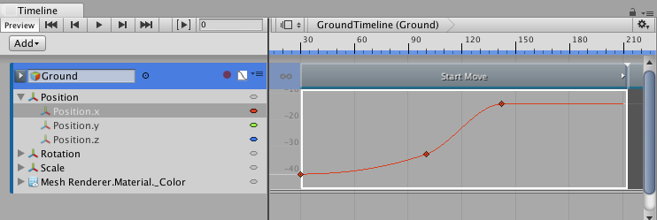

### 隐藏和显示曲线

对于所选动画剪辑，曲线视图随动画曲线提供一个属性层级视图列表。通过展开、选择和取消选择此列表中的属性，可过滤曲线视图中显示的动画曲线。

例如，要仅显示沿 X 轴的位置的动画曲线，请展开 __Position__ 并选择 __Position.x__ 属性。按 F 即可定格 __Position.x__ 属性的动画曲线。

曲线视图支持以下选择和取消选择动画曲线的方法：

* 单击父属性的三角形图标可展开和折叠其子属性列表。

* 按住 Shift 并单击可选择连续的属性。

* 按住 Command/Control 并单击可选择不连续的属性。按住 Command/Control 并单击所选属性可取消选择。

---
* 2017-08-10  Page published with limited [editorial review](DocumentationEditorialReview.html)

