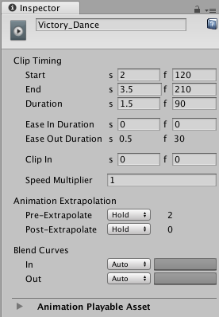
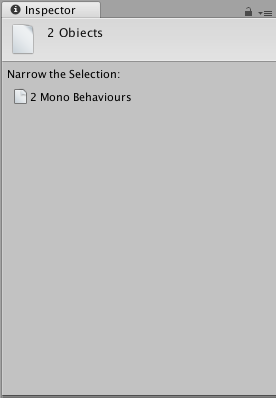

# 时间轴和 Inspector 窗口

Inspector 窗口显示有关所选游戏对象的信息，包括所有附加组件及其属性。本部分将介绍在选择一个或多个时间轴对象（时间轴资源、轨道或剪辑）时显示的 Inspector 窗口中的属性。

如果选择单个时间轴对象，则 Inspector 窗口将显示所选对象的属性。例如，如果选择动画剪辑，则 Inspector 窗口将显示所选动画剪辑的[公共属性](TimelineAnimationClipProperties.html)和[可播放资源属性](TimelineAnimationClipPlayableProperties.html)。

如果选择多个时间轴对象，并且所选对象包括具有公共属性的时间轴对象，则 Inspector 窗口显示两部分：一部分包含适用于整个选择范围的属性，另一部分包含单独适用于每个所选对象的公共属性。

例如，如果在一个轨道上选择音频剪辑，在另一个轨道上选择两个动画剪辑，则 Inspector 窗口将包含 **Multiple Clip Timing** 属性和 **Clip Timing** 属性：

* 使用 **Multiple Clip Timing** 可按组的形式更改所选对象的 Start 或 End 属性。例如，如果将 Start 更改为第 30 帧，则所选的剪辑将开始于第 30 帧。这会将第一个剪辑的开始移动到第 30 帧，并相对于第一个剪辑来放置其余所选剪辑，遵循所选剪辑之间的空白。

* 使用 **Clip Timing** 属性可单独更改每个所选剪辑的公共属性。例如，如果将 Ease In Duration 更改为 10 帧，则每个所选剪辑的 Ease In Duration 将更改为 10 帧。

如果所选对象包括没有公共属性的时间轴对象，则 Inspector 窗口会提示缩小选择范围。例如，如果在 Timeline Editor 中选择动画轨道和音频剪辑，则会提示缩小选择范围。

---
* 2017-12-07  Page amended with limited [editorial review](DocumentationEditorialReview.html)

