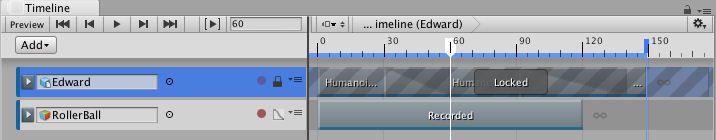

### 锁定轨道

通过锁定轨道可锁定对轨道以及轨道使用的任何剪辑的编辑。

如果轨道上的动画已完成并希望避免无意中修改轨道，此时便可使用锁定。无法编辑锁定的轨道，也无法选择其剪辑。锁定的轨道由锁图标进行标识。

要锁定某个轨道，请右键单击该轨道，然后从上下文菜单中选择 __Lock__。也可选择一个轨道并按 L。一次可选择和锁定多个轨道。

__注意：__仍可删除锁定的轨道。

---
* 2017-08-10  Page published with limited [editorial review](DocumentationEditorialReview.html)

