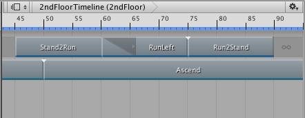
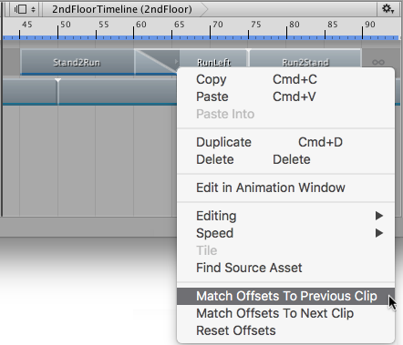

# 匹配剪辑偏移

每个动画剪辑包含关键动画或运动（用于动画化游戏对象）或人形角色（绑定到动画轨道）。将动画剪辑添加到动画轨道时，动画剪辑的关键动画或运动不会自动匹配动画轨道上的上一个剪辑或下一个剪辑。默认情况下，每个动画剪辑在游戏对象的位置和旋转处开始，对于人形角色，则在时间轴实例的开头处开始。

要让动画序列在相邻的动画剪辑之间无缝流动，必须使每个动画剪辑与上一个或下一个剪辑匹配。匹配剪辑将为每个动画剪辑添加位置和旋转偏移（称为剪辑根运动偏移）。以下部分将介绍如何匹配两个动画剪辑或更多动画剪辑。

## 匹配两个剪辑

要匹配两个剪辑之间的根运动，右键单击要匹配的动画剪辑。从上下文菜单中，选择 Match Offsets to Previous Clip 或 Match Offsets to Next Clip。

上下文菜单仅显示可用于所点击的动画剪辑的 Match Offset 选项。例如，如果点击的动画剪辑**之前**有空白，则只有 Match Offsets to Next Clip 菜单项可用。

为单个动画剪辑匹配偏移时，不需要首先选择动画剪辑，但必须右键单击要匹配的动画剪辑。例如，如果右键单击未选定的动画剪辑，则会匹配单击的剪辑，并忽略所有选定的动画剪辑。

## 匹配多个剪辑

要匹配多个剪辑的根运动，请选择要匹配的动画剪辑，然后右键单击一个选定剪辑。从上下文菜单中，选择 Match Offsets to Previous Clip 或 Match Offsets to Next Clip。

---
* 2017-12-07  Page published with no [editorial review](DocumentationEditorialReview.html)

