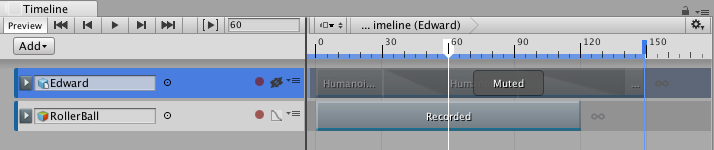

### 轨道静音

将某个轨道静音可禁用该轨道的剪辑并在场景中隐藏这些剪辑。

当时间轴实例包含许多带动画的轨道，而您希望专注于一个或几个轨道的动画时，也可以使用静音。已静音的轨道由静音图标进行标识。

要静音某个轨道，请右键单击该轨道，然后从上下文菜单中选择 __Mute__。也可选择一个轨道并按 M。一次可选择和静音多个轨道。要取消某个轨道的静音，请单击静音图标。

---
* 2017-08-10  Page published with limited [editorial review](DocumentationEditorialReview.html)

