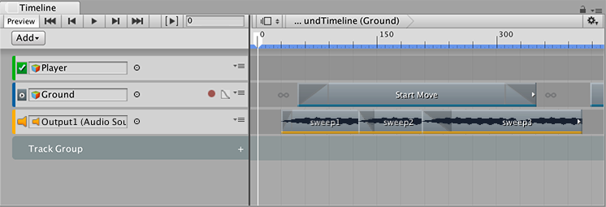
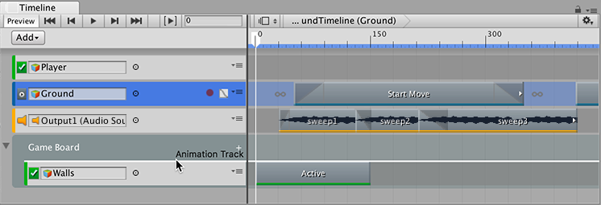
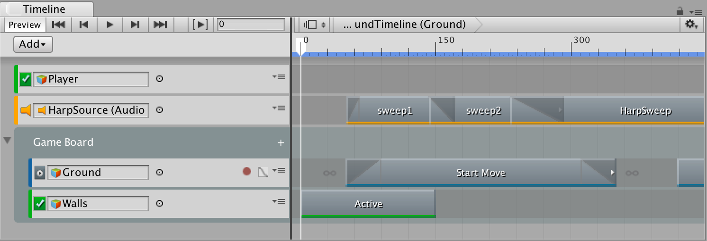
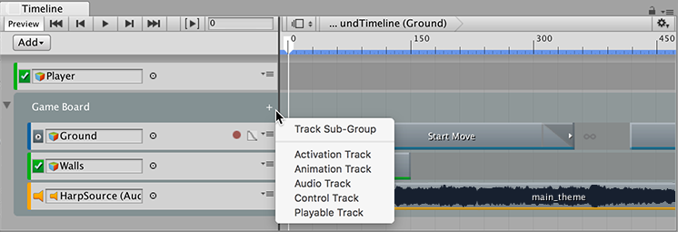

### 将轨道组织到轨道组中

在处理多个轨道时，可使用轨道组来组织轨道。例如，时间轴资源包含与同一游戏对象交互的动画轨道和音频轨道。要组织这些轨道，可将这些轨道移动到各自的轨道组中。

要添加轨道组，请单击 Add 按钮，然后从 Add 菜单中选择 __Track Group__。还可以右键单击轨道列表的空白区域，然后从上下文菜单中选择 __Track Group__。轨道列表底部将添加一个新的轨道组。

要重命名轨道组，请单击名称，然后会出现工字形光标。输入轨道组的新名称，然后按回车键。

要将轨道移动到轨道组，请选择一个或多个轨道并拖动到轨道组上。轨道组将突出显示。拖动选定的轨道时，最后选择的轨道类型将显示在光标旁边。要将这些轨道放在轨道组中的特定轨道之前，请拖动直到白线指示目标位置。

一个轨道组也可具有任意数量的轨道子组。要添加轨道子组，请选择轨道组并单击轨道列表中的 Add 按钮，或单击轨道组名称旁边的加号图标，然后选择 __Track Sub-Group__。也可以使用此菜单将轨道直接添加到轨道组或轨道子组。

---
* 2017-08-10  Page published with limited [editorial review](DocumentationEditorialReview.html)

