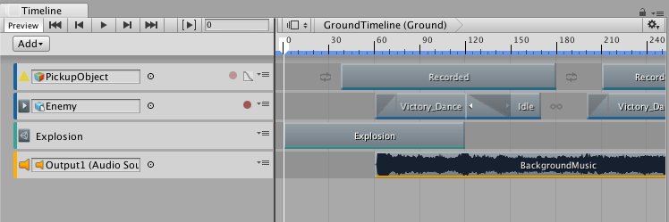
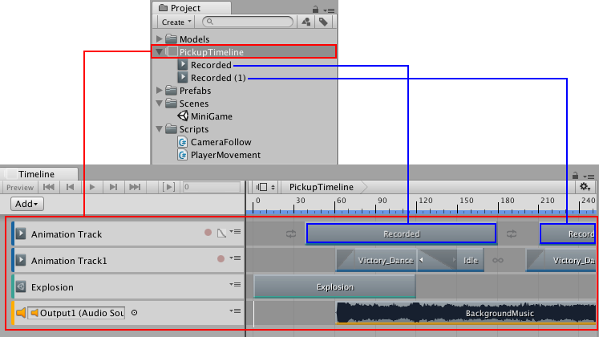
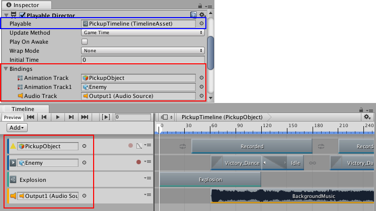
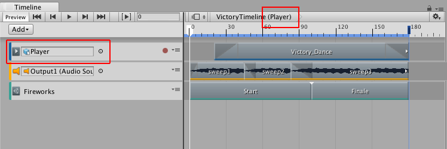
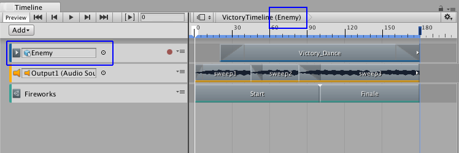

# 时间轴概述

使用 __Timeline Editor 窗口__可通过直观排列链接到场景游戏对象的轨道和剪辑来创建过场动画、影片和游戏序列。

对于每个过场动画、影片或游戏序列，Timeline Editor 窗口将保存下列内容：

* __时间轴资源__：存储轨道、剪辑和录制动画，而不存储要动画化的特定游戏对象的链接。时间轴资源将保存到项目。

* __时间轴实例__：存储由时间轴资源动画化的特定游戏对象的链接。这些链接（称为__绑定__）将保存到场景。

## 时间轴资源

Timeline Editor 窗口将轨道和剪辑定义保存为__时间轴资源__。如果在创建影片、过场动画或游戏序列时录制关键动画，则 Timeline Editor 窗口会将录制的动画保存为时间轴资源的子项。

## 时间轴实例

尽管时间轴资源定义了过场动画、影片或游戏序列的轨道和剪辑，但无法将时间轴资源直接添加到场景。要使用时间轴资源对场景中的游戏对象进行动画化，必须创建__时间轴实例__。

Timeline Editor 窗口提供了一种在[创建时间轴资源](TimelineWorkflowCreatingAssetInstance.html)时创建时间轴实例的自动化方法。

如果在场景中选择的某个游戏对象具有与时间轴资源关联的 Playable Director 组件，则绑定将显示在 Timeline Editor 窗口和 Playable Director 组件（Inspector 窗口）中。

## 重复使用时间轴资源

由于时间轴资源和时间轴实例是分开的，因此可将同一时间轴资源重复用于多个时间轴实例。

例如，可创建名为 VictoryTimeline 的时间轴资源，在其中包含在主要游戏角色 (Player) 获胜时播放的动画、音乐和粒子效果。要重复使用 VictoryTimeline 时间轴资源以动画化同一场景中的另一个游戏角色 (Enemy)，可为次要游戏角色创建另一个时间轴实例。

由于重复使用时间轴资源，因此在 Timeline Editor 窗口中对时间轴资源进行的任何修改都会导致对所有时间轴实例进行更改。

例如，在上一个示例中，如果在修改 Player 时间轴实例时在 Timeline Editor 窗口中删除 Fireworks 控制轨道，则会从 VictoryTimeline 时间轴资源中删除该轨道。此外还会从 VictoryTimeline 时间轴资源的所有实例（包括 Enemy 时间轴实例）中删除 Fireworks 控制轨道。

---

##What's the difference between the Animation window and the Timeline window?

###The Timeline window

The [Timeline window](TimelineEditorWindow.html) allows you to create cinematic content, game-play sequences, audio sequences and complex particle effects. You can animate many different GameObjects within the same sequence, such as a cut scene or scripted sequence where a character interacts with scenery. In the timeline window you can have multiple types of [track](TimelineTrackList.html), and each track can contain multiple [clips](TimelineClipsView.html) that can be moved, trimmed, and blended between. It is useful for creating more complex animated sequences that require many different GameObjects to be choreographed together.

The Timeline window is newer than the Animation window. It was added to Unity in version 2017.1, and supercedes some of the functionality of the Animation window. To start learning about Timeline in Unity, visit the [Timeline section](TimelineSection.html) of the user manual.

###The Animation window

The [Animation window](AnimationEditorGuide.html) allows you to create individual [animation clips](animeditor-CreatingANewAnimationClip.html) as well as viewing [imported animation clips](AnimationsImport.html). Animation clips store animation for a single GameObject or a single hierarchy of GameObjects. The Animation window is useful for animating discrete items in your game such as a swinging pendulum, a sliding door, or a spinning coin. The animation window can only show one animation clip at a time.

The Animation window was added to Unity in version 4.0. The Animation window is an older feature than the Timeline window. It provides a simple way to create animation clips and animate individual GameObjects, and the clips you create in the Animation window can be combined and blended between using anim [Animator controller](Animator.html). However, to create more complex sequences involving many disparate GameObjects you should use the Timeline window (see above).

The animation window has a "timeline" as part of its user interface (the horiontal bar with time delineations marked out), however this is separate to the Timeline window.

To start learning about animation in Unity, visit the [Animation section](AnimationSection.html) of the user manual.

 

---
* 2017-08-10  Page published with limited [editorial review](DocumentationEditorialReview.html)

