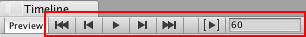
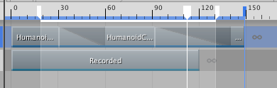
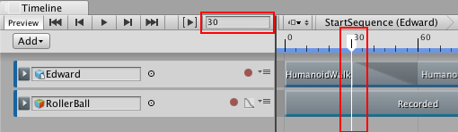

## 时间轴播放控件

使用时间轴播放控件中的按钮和字段可播放时间轴实例并控制时间轴播放头的位置。

### Timeline Start 按钮

 

单击 Timeline Start 按钮，或按住 Shift 并按逗号 (,)，即可将时间轴播放头移动到时间轴实例的开头。

### Previous Frame 按钮

 

单击 Previous Frame 按钮，或按逗号 (,)，即可将时间轴播放头移动到上一帧。

### Timeline Play 按钮

 

单击 Timeline Play 按钮，或按空格键，即可在时间轴播放模式下预览时间轴实例。时间轴播放模式执行以下操作：

* 在时间轴播放头的当前位置开始回放，并继续到时间轴实例的末尾。如果启用了 Play Range 按钮，则回放将限制在指定的时间范围内。

* 时间轴播放头位置沿时间轴实例移动。Playhead Location 字段根据[时间轴设置](TimelineSettings.html)以帧数或秒数显示时间轴播放头的位置。

* 要暂停回放，请再次单击 Timeline Play 按钮，或按空格键。

* 当回放到达时间轴实例的末尾时，Wrap Mode 确定回放是应该暂停、重复还是不执行任何操作。Wrap Mode 设置是 [Playable Director 组件](class-PlayableDirector.html)的属性。

时间轴播放模式提供 Timeline Editor 窗口中时间轴实例的预览。时间轴播放模式仅用于模拟不支持音频回放的游戏模式。要预览包含音频的时间轴实例，可启用 Playback Director 组件中的 Play on Awake 选项并使用播放模式预览游戏。

### Next Frame 按钮

 

单击 Next Frame 按钮，或按句号 (.)，即可将时间轴播放头移动到下一帧。

### Timeline End 按钮

 

单击 Timeline End 按钮，或按住 Shift 并按句号 (.)，即可将时间轴播放头移动到时间轴的结尾。

### Play Range 按钮

 

启用 Play Range 按钮可将回放限制为特定的秒数或帧数范围。时间轴会突出显示播放范围，并以白色标记指示开始和结束位置。要修改播放范围，请拖动任一标记。

[Playable Director 组件](class-PlayableDirector.html)的 __Wrap Mode__ 属性确定了回放到达结束标记时要执行的操作。

只有在 Timeline Editor 窗口中预览时间轴实例时，才能设置播放范围。在播放模式下，Unity 将忽略播放范围。

### Playhead Location 字段和时间轴播放头

时间轴播放头指示在 Timeline Editor 窗口中预览的具体时间点。Playhead Location 字段以帧数或秒数表示时间轴播放头的位置。

要将时间轴播放头跳转到特定时间，请单击时间轴。还可以在 Playhead Location 字段中输入时间值，然后按 Enter 键。输入值时，系统会根据时间轴设置将帧转换为秒或者将秒转换为帧。例如，如果时间轴表示为秒数且帧率为 30 帧/秒，则在 Playhead Location 字段中输入 180 会将 180 帧转换为秒，并将时间轴播放头移至 6:00。

要设置 Timeline Editor 窗口使用的时间格式，请使用[时间轴设置](TimelineSettings.html)。

---
* 2017-08-10  Page published with limited [editorial review](DocumentationEditorialReview.html)

