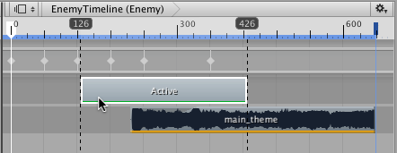
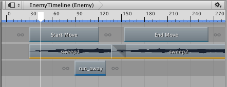
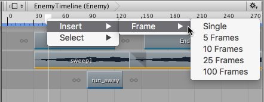
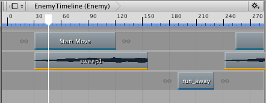

### 定位剪辑

要在轨道上定位剪辑，请选择一个或多个剪辑并拖动。拖动时，黑色引导线指示所定位的剪辑的范围。时间轴显示所定位的剪辑的开始时间和结束时间。

还可以通过选择剪辑并在 [Inspector 窗口](script-EditorClip.html)中更改其开始时间来定位剪辑。此方法仅在选择单个剪辑时有效。Inspector 窗口不能显示多个剪辑的属性。

可将剪辑移动到相同类型的另一个轨道。垂直拖动所选剪辑，此时可借助所选剪辑的虚影查看移动剪辑的结果。

定位剪辑时，如果剪辑与同一轨道上的另一个剪辑重叠，则会发生混合或覆盖，具体发生的情况取决于轨道的类型：

* 激活轨道、控制轨道或可播放轨道。当两个剪辑在这些轨道上彼此重叠时，第二个剪辑将覆盖第一个剪辑。通过这样的方式定位剪辑可使一个剪辑隐藏另一个剪辑。

* 动画轨道、动画覆盖轨道和音频轨道：当两个剪辑在这些轨道上彼此重叠时，第一个剪辑会混合到第二个剪辑中。这很有用，例如可用于在两个动画剪辑之间创建无缝过渡。

还可以通过将帧插入时间轴播放头的位置来定位剪辑。在剪辑视图上方的时间轴上右键单击时间轴播放头，然后选择 __Insert__ > __Frame__ 和多个帧。这样就会将帧插入时间轴播放头位置的时间轴资源中。插入帧仅会重新定位在时间轴播放头位置__之后__开始的剪辑。

---
* 2017-08-10  Page published with limited [editorial review](DocumentationEditorialReview.html)

