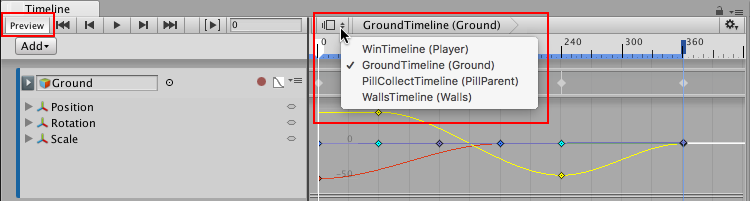

## 时间轴预览和时间轴选择器

使用时间轴选择器 (Timeline Selector) 可选择要在 Timeline Editor 窗口中查看、修改或预览的时间轴实例。Timeline Preview（时间轴预览）按钮可允许或禁止预览所选时间轴实例对场景的影响。

要选择时间轴实例，请单击时间轴选择器以显示当前场景中的时间轴实例列表。

每个菜单项会显示时间轴资源的名称及其在当前场景中关联的游戏对象。例如，名为 GroundTimeline 的时间轴资源与 Ground 游戏对象关联，因此显示为“GroundTimeline (Ground)”。

---
* 2017-08-10  Page published with limited [editorial review](DocumentationEditorialReview.html)

