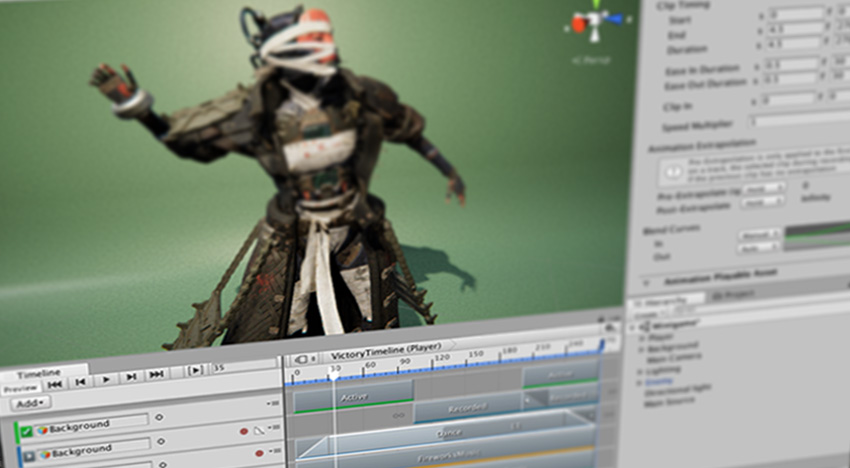

# 时间轴

使用 Unity 的时间轴可创建影片内容、游戏序列、音频序列和复杂的粒子效果。

使用 Unity 的时间轴创建的每个过场动画、影片或游戏序列都包含时间轴资源和时间轴实例。[Timeline Editor 窗口](TimelineEditorWindow.html)同时创建和修改时间轴资源和时间轴实例。

[“时间轴概述”部分](TimelineOverview.html)包含有关 Timeline Editor 窗口、时间轴资源和时间轴实例之间关系的详细信息。

[“时间轴工作流程”部分](TimelineWorkflows.html)介绍如何创建时间轴资源和时间轴实例，如何录制基本动画，以及如何创建影片。

---
* 2017-08-10  Page published with limited [editorial review](DocumentationEditorialReview.html)

* Unity [2017.1](https://docs.unity3d.com/2017.1/Documentation/Manual/30_search.html?q=newin20171) 中的新功能 NewIn20171
