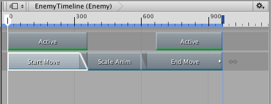
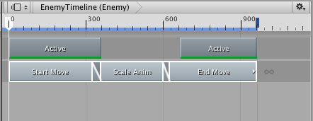
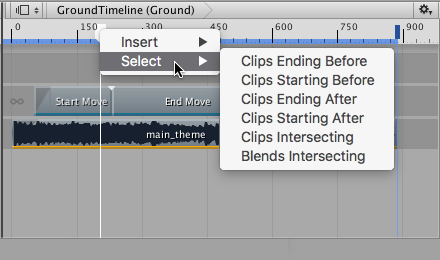

### 选择剪辑

通过单击可选择单个剪辑。选择某个剪辑会取消选择所有其他轨道或剪辑。剪辑区域以白色边框显示所选剪辑。

选择剪辑会在 Inspector 窗口中显示其属性，允许更改剪辑的开头、持续时间和其他剪辑属性。可用属性根据所选剪辑的类型而变化。有关详细信息，请参阅[时间轴检视面板 (Timeline Inspector)](TimelineInspector.html)。

按住 Shift 并单击可选择连续的剪辑。例如，要选择三个连续的剪辑，单击第一个剪辑，然后按住 Shift 并单击第三个剪辑。这样就能选择所有三个剪辑。

按住 Command/Control 并单击可选择不连续的剪辑。按住 Command/Control 并单击所选剪辑可取消选择。

单击并拖动剪辑视图中的空白区域可绘制选框。此操作将选择与选框相交的所有剪辑。绘制选框时按住 Shift 键可将剪辑添加到当前选择范围。

还可以使用时间轴播放头选择剪辑。右键单击剪辑视图上方时间轴上的时间轴播放头，然后选择一个选择选项。此操作将选择在时间轴播放头之后开始、之前开始、之后结束、之前结束或与之相交的剪辑。这样就能选择所有轨道上的剪辑。

---
* 2017-08-10  Page published with limited [editorial review](DocumentationEditorialReview.html)

