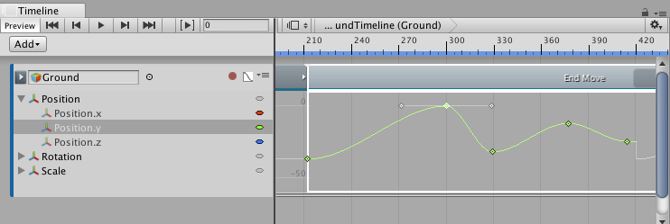
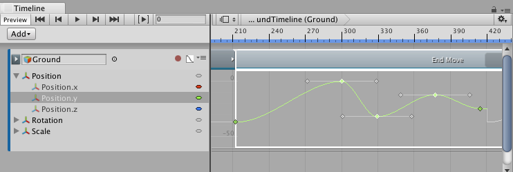

### 选择关键点

通过单击可选择单个关键点。选择某个关键点会取消选择所有其他所选关键点。曲线视图会显示所选关键点及其切线。

曲线视图提供了以下选择关键点的方法：

* 按住 Shift 并单击可选择连续的关键点。例如，要沿同一动画曲线选择连续关键点，请单击第一个关键点，然后按住 Shift 并单击最后一个关键点。

* 按住 Command/Control 并单击可选择不连续的关键点。按住 Command/Control 并单击所选关键点可取消选择。

* 单击并拖动曲线视图中的空白点可绘制选框。此操作将选择选框内的所有关键点。绘制选框时按住 Shift 键可将关键点添加到当前选择范围。

* 双击所选关键点可选择同一动画曲线上的所有关键点。

---
* 2017-08-10  Page published with limited [editorial review](DocumentationEditorialReview.html)

