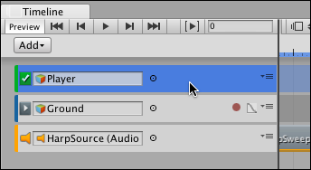
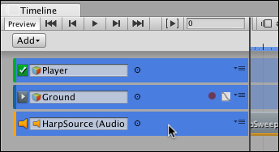

### 选择轨道

通过单击可选择单个轨道。选择某个轨道会取消选择所有其他轨道或剪辑。选择轨道会在 Inspector 窗口中显示其属性。可用属性根据所选轨道的类型而变化。

要选择连续轨道，请选择第一个轨道，然后按住 Shift 并单击该系列中的最后一个轨道。例如，要选择三个连续轨道，单击第一个轨道，然后按住 Shift 并单击第三个轨道。这样就能选择所有三个轨道。

按住 Command/Control 并单击可选择不连续的轨道。按住 Command/Control 并单击可取消选择所选轨道。

---
* 2017-08-10  Page published with limited [editorial review](DocumentationEditorialReview.html)

