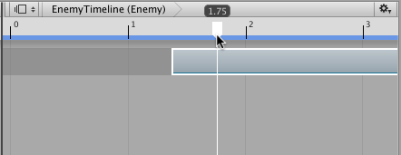

## 时间轴设置

使用时间轴设置可设置时间轴资源的度量单位，设置时间轴资源的持续时间模式，以及设置 Timeline Editor 窗口对齐设置。

### Seconds 或 Frames

选择 Seconds 或 Frames 可将 Timeline Editor 窗口设置为以秒或帧为单位显示时间。

### Duration Mode

使用 Duration Mode 可设置时间轴资源的持续时间是延伸到最后一个剪辑的结尾 (Based On Clips)，还是延伸到特定时间或帧 (Fixed Length)。当 Duration Mode 设置为 Fixed Length 时，请使用以下方法之一更改时间轴资源的长度：

* 在 Project 窗口中选择时间轴资源，然后使用 Inspector 窗口以秒或帧为单位设置持续时间 (Duration)。

* 在 Timeline Editor 窗口中，拖动时间轴上的蓝色标记。蓝色标记表示时间轴资源的结尾。蓝色线表示时间轴资源的持续时间。

### Frame Rate

在 Frame Rate 下面选择其中一个选项可设置时间轴资源的播放速度。时间轴资源的总体速度根据每秒帧数而加速或减速。每秒帧数越高，整个时间轴播放的速度就越快。支持以下帧率：Film (24 fps)、PAL (25 fps)、NTSC (29.97 fps)、30、50 或 60。

### Show Audio Waveforms

启用 __Show Audio Waveforms__ 可绘制所有音频轨道上所有音频剪辑的波形。例如，使用人形角色行走的动画剪辑来手动定位脚步声的音频剪辑时，请使用音频波形作为参照。禁用 __Show Audio Waveform__ 可隐藏音频波形。默认情况下会启用 __Show Audio Waveforms__。

### Snap to Frame

启用 __Snap to Frame__ 可操纵剪辑，预览时间轴实例，拖动播放头，以及使用帧来定位播放头。禁用 __Snap to Frame__ 可使用子帧。默认情况下会启用 __Snap to Frame__。

例如，禁用 __Snap to Frame__ 并拖动时间轴播放头时会在帧之间移动播放头，Playhead Location 的格式根据时间轴设置为 __Seconds__ 还是 __Frames__ 而以不同方式显示：

* 当时间轴设置为 __Frames__ 时，Playhead Location 字段显示帧和子帧。例如，8 帧和 34 子帧显示为 8.34。

* 当时间轴设置为 __Seconds__ 时，Playhead Location 字段显示秒、帧和子帧。例如，6 秒、17 帧和 59 子帧显示为 6:17 [.59]。

在尝试将动画和效果与音频同步时，操纵剪辑、预览时间轴实例以及在子帧级别定位播放头是非常有用的操作。许多高端音频处理软件产品都能创建具有子帧精度的音频波形。

### Edge Snap

启用 __Edge Snap__ 选项可在定位、修剪和创建混合期间对齐剪辑。启用此选项后，当剪辑的开头或结尾拖动到另一个轨道上剪辑的开头或结尾的 10 个像素内时、同一个轨道上剪辑的开头或结尾的 10 个像素内时、整个时间轴的开始或结尾的 10 个像素内时或者播放头的 10 个像素内时，剪辑将相应对齐。禁用 __Edge Snap__ 可创建精确的混合、缓入或缓出。默认情况下会启用 __Edge Snap__。

---
* 2017-12-07  Page amended with limited [editorial review](DocumentationEditorialReview.html)

