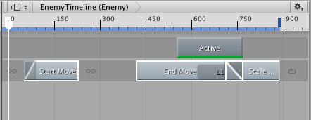
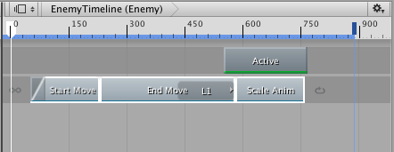

### 平铺剪辑

通过平铺剪辑可消除同一轨道上的剪辑之间的空白、混合和重叠。如果希望每个剪辑恰好从上一个剪辑的结束位置开始，则平铺剪辑非常有用。在平铺剪辑时，必须在同一轨道上选择至少两个剪辑。

所选剪辑基于第一个所选剪辑定位。第一个所选剪辑不会移动。如果在多个轨道上选择多个剪辑，则必须在同一轨道上选择至少两个剪辑才能使平铺生效。

---
* 2017-08-10  Page published with limited [editorial review](DocumentationEditorialReview.html)

