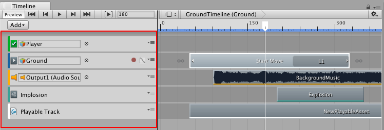

## 轨道列表

使用轨道列表可对包含时间轴资源的轨道进行添加、选择、复制、删除、锁定、静音和重新排序。还可以将轨道组织到轨道组中。

彩色强调线用于标识每种类型的轨道。默认情况下，激活轨道为绿色，动画轨道为蓝色，音频轨道为橙色，控制轨道为青绿色，可播放轨道为白色。

每个轨道上的绑定都保存到时间轴实例。Playable Director 组件与链接到时间轴资源的游戏对象关联。此关联称为时间轴实例。请参阅[时间轴概述](TimelineOverview.html)以了解详细信息。

---
* 2017-08-10  Page published with limited [editorial review](DocumentationEditorialReview.html)

