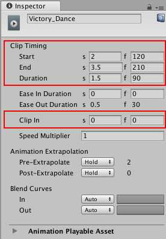
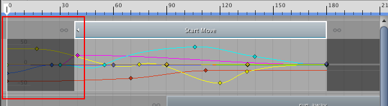
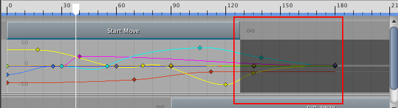
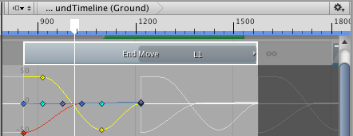
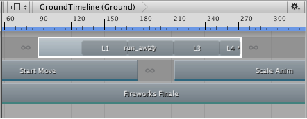
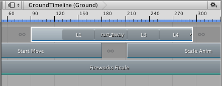
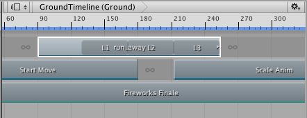
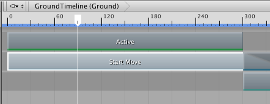
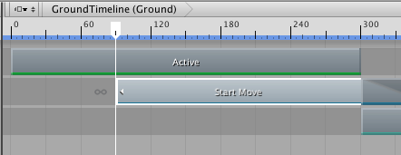

### 修剪剪辑

拖动剪辑的开头或结尾即可修剪其持续时间。拖动剪辑的开头或结尾会自动选择剪辑，并在 Inspector 窗口中显示其属性。使用 Inspector 窗口中的 [Clip Timing 属性](script-EditorClip.html)可将剪辑的开始、结束、持续时间和偏移 (Clip In) 设置为精确值。

#### 修剪剪辑的开头

在剪辑视图中修剪动画剪辑或音频剪辑的开头时，无法将开头拖动到剪辑所基于的源资源的开头之前。修剪源资源开头之后的动画剪辑或音频剪辑将会选择该剪辑使用的源资源部分。

修剪剪辑没有破坏性。再次修剪剪辑可修改其开头，从而包含上次修剪过程剪切掉的动画或音频波形。还可以[重置剪辑](TimelineResettingClips.html)来撤销修剪操作或其他编辑操作。

要将剪辑的开头修剪到某个精确的时间或帧，请使用 Inspector 窗口中的 __Clip In__ 属性。更改 __Clip In__ 属性的效果等同于在剪辑的源资源开头之后修剪剪辑的开头。

#### 修剪剪辑的结尾

就像剪辑的开头一样，修剪源资源结尾之前的动画剪辑或音频剪辑将会修剪该剪辑使用的源资源部分。

如果修剪动画剪辑或音频剪辑的结尾时超过了剪辑所基于的源资源的结尾，则额外的剪辑区域将暂停或循环，具体取决于源资源的设置。

例如，名为“End Move”的动画剪辑使用动作文件“Recorded(2)”作为其源资源。动作文件“Recorded(2)”设置为循环。修剪动画剪辑的结尾超过“Recorded(2)”源资源的结尾将会通过循环“Recorded(2)”来填充额外的剪辑区域。白色动画曲线将显示暂停或循环。

要选择额外剪辑区域为暂停还是循环，请选择源资源以便在 Inspector 窗口中更改其设置。根据源资源的类型，由不同属性控制源资源是暂停还是循环。

如果不确定剪辑使用的哪个源资源，请在剪辑视图中选择该剪辑，然后右键单击并从上下文菜单中选择 __Find Source Asset__。此时将在 Project 窗口中突出显示源资源。

#### 修剪循环剪辑的结尾

Timeline Editor 窗口为循环播放的动画剪辑或音频剪辑提供了一些特殊修剪选项。这些特殊修剪选项用于删除最后的不完整循环，或者完成最后的不完整循环。

例如，名为 run_away 的动画剪辑的长度是该剪辑所基于的源资源的长度的三倍多。由于源资源设置为循环，因此动画剪辑将循环源剪辑，直至动画剪辑结束，这将导致一个不完整循环。

要延伸剪辑的结尾并完成不完整循环，请选择该剪辑，然后右键单击并选择 __Editing__ > __Complete Last Loop__。要在最后一个完整循环中修剪剪辑，请选择该剪辑，然后右键单击并选择 __Editing__ > __Trim Last Loop__。

#### 使用时间轴播放头进行修剪

还可以根据播放头的位置来修剪剪辑。要使用播放头进行修剪，请在要修剪的剪辑中定位播放头。右键单击剪辑并选择 __Editing__ > __Trim Start__ 或 __Editing__ > __Trim End__。__Trim Start__ 会将剪辑的开头修剪到播放头。__Trim End__ 会将剪辑的结尾修剪到播放头。

如果选择多个轨道上的剪辑，则仅会修剪与播放头相交的所选剪辑。

---
* 2017-08-10  Page published with limited [editorial review](DocumentationEditorialReview.html)

