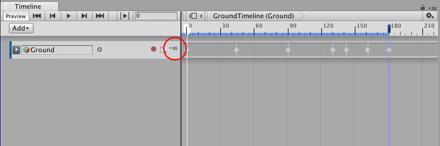
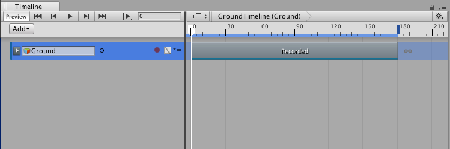

## 将无限剪辑转换为动画剪辑

无限剪辑显示为关键帧清单。无法定位、修剪或拆分无限剪辑，因为这种剪辑不会定义大小。要在无限剪辑上定位、修剪、拆分或执行其他剪辑操作，必须先将无限剪辑转换为动画剪辑。

要将无限剪辑转换为动画剪辑，请单击 Track 菜单图标，然后选择 __Convert to Clip Track__。也可以右键单击该轨道，然后从上下文菜单中选择 __Convert to Clip Track__。Track 菜单和上下文菜单是相同的。

---
* 2017-08-10  Page published with limited [editorial review](DocumentationEditorialReview.html)

