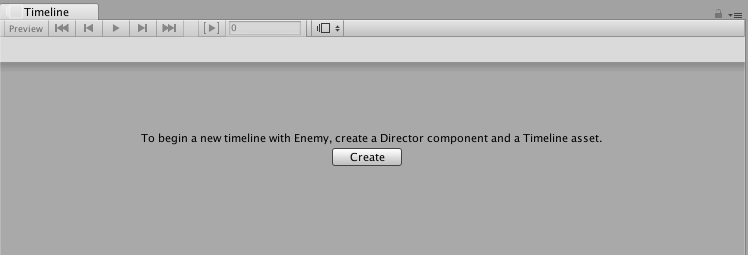

## 创建时间轴资源和时间轴实例

要在场景中使用时间轴资源，请使用 Playable Director 组件将时间轴资源关联到游戏对象。将时间轴资源与 Playable Director 组件相关联可创建时间轴实例，并允许指定场景中的哪些对象将由时间轴资源进行动画化。游戏对象还必须具有动画器组件。

Timeline Editor 窗口提供了一种在创建新时间轴资源时创建时间轴实例的自动化方法。Timeline Editor 窗口还会创建所有必要的组件。

要创建新的时间轴资源和时间轴实例，请按照下列步骤操作：

1.在场景中，选择一个游戏对象以用作影片的焦点或用作其他基于游戏运行过程的序列的焦点。

2.打开 Timeline Editor 窗口（菜单：__Window__ > __Timeline Editor__）。如果游戏对象还不具备附加到时间轴资源的 Playable Director 组件，则 Timeline Editor 窗口中会有一条消息提示单击 __Create__ 按钮。

1.单击 __Create__。此时将出现一个对话框，提示输入要创建的时间轴资源的名称和位置。还可以指定标签来标识时间轴资源。

2.单击 __Save__。

Unity 会执行以下操作：

* 将新的时间轴资源保存到项目。如果未更改要创建的时间轴资源的名称和位置，则时间轴资源的名称将基于所选的游戏对象并带有“Timeline”后缀。例如，默认情况下，选择名为“Enemy”的游戏对象会将资源命名为“EnemyTimeline”，并将其保存到项目的 Assets 目录中。

* 将空动画轨道添加到时间轴资源。

* 将 [Playable Director 组件](class-PlayableDirector.html)添加到所选游戏对象，并将 __Playable__ 属性设置为 Timeline Asset。此过程将创建一个时间轴实例。

* 在 Playable Director 组件中，动画轨道的绑定将设置为所选游戏对象。动画轨道没有任何剪辑，因此所选的游戏对象不会动画化。

* 将动画器组件添加到所选游戏对象。动画器组件通过时间轴实例对游戏对象进行动画化。如果没有动画器组件，游戏对象就无法动画化。

---
* 2017-08-10  Page published with limited [editorial review](DocumentationEditorialReview.html)

