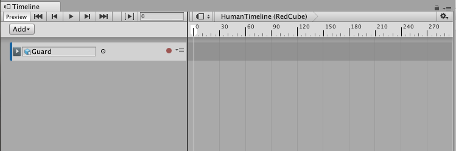
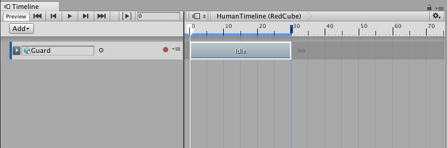
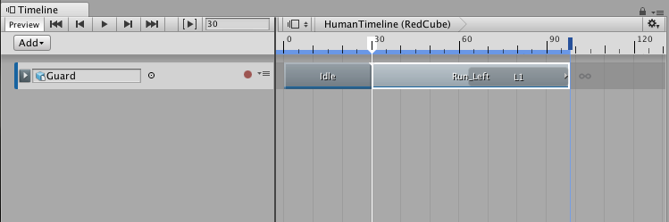
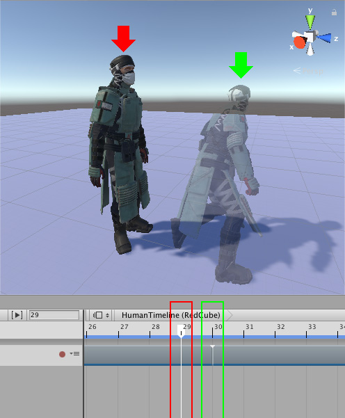
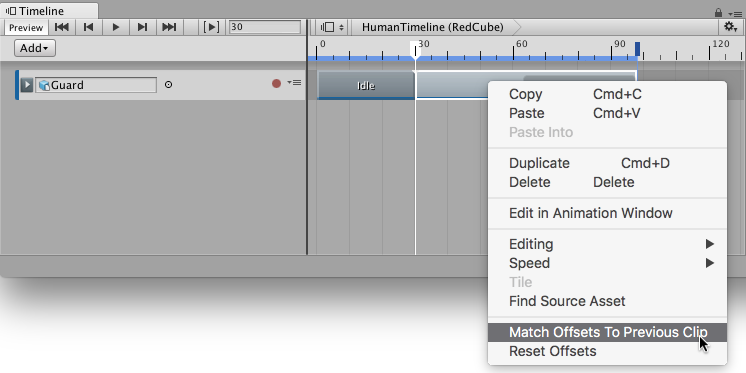
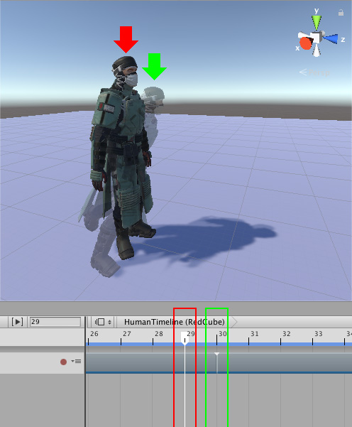
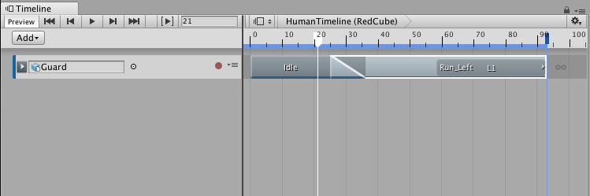
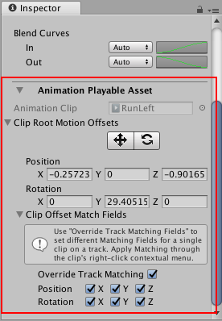
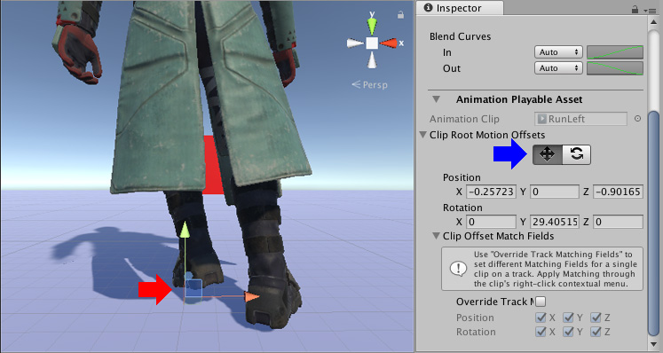

# 创建人形动画

此工作流程将演示如何使用时间轴实例借助外部动作剪辑来动画化人形角色。此工作流程还将演示如何匹配剪辑偏移、手动调整剪辑偏移以及在剪辑之间创建混合以最小化跳跃和滑动。虽然此工作流程使用人形角色，但可将此动画方法用于任何游戏对象。

此工作流假定已事先创建一个时间轴实例，其中有一个空动画轨道绑定到一个人形角色。

从项目中，将动作剪辑拖入动画轨道以便创建新的动画剪辑。例如，拖动空闲姿势作为第一个剪辑，从空闲位置开始创建人形角色。根据需要定位空闲剪辑并调整其大小。

添加第二个动作剪辑。在此示例中，将奔跑左转剪辑（名为 Run_Left）拖动到动画轨道上。根据需要调整 Run_Left 剪辑的大小。在此示例中，Run_Left 剪辑的大小调整为包含一个循环，使 Guard 奔跑并 180 度转弯。

播放时间轴实例。请注意，人形角色 Guard 会在每个动画剪辑之间跳跃。此问题的原因是第一个动画剪辑 (Idle) 结尾处的人形角色位置与下一个动画剪辑 (Run_Left) 开头的位置不匹配。

要修复剪辑之间的跳跃，请[匹配每个动画剪辑的偏移](TimelineMatchOffsets.html)。Timeline Editor 窗口提供了几种匹配偏移的不同方法。在此示例中，第二个动画剪辑与前一个剪辑匹配。为此，请选择 Run_Left 剪辑，然后右键单击并选择 Match Offsets to Previous Clip。

再次播放时间轴实例。虽然人形角色的位置和旋转匹配，但两个动画剪辑之间仍然存在跳跃，这是因为人形角色处于不同的姿势。在第一个动画剪辑的结尾，人形角色直立，双脚并拢。在第二个动画剪辑的开头，人形角色向前弯腰，双脚分开。

应创建一个混合来移除跳跃并在两个姿势之间过渡。调整剪辑的大小、混合区域 (Blend Area)、剪辑输入 (Clip In) 和每个混合曲线 (Blend Curve) 的形状，从而在两个姿势之间创建过渡。例如，在 Idle 剪辑和 Run_Left 剪辑之间的过渡中，Idle 剪辑的持续时间更改为 36，而 Run_Left 剪辑重新定位为从第 25 帧开始。其余属性保留为默认值。

当 Idle 剪辑过渡到 Run_Left 剪辑时，混合会消除姿势之间的明显跳跃并在大部分身体部位之间自然过渡。然而，在脚的不同位置之间混合会导致不自然的脚滑动。

要修正脚滑动问题，可手动调整动画剪辑的根偏移，使脚的位置变化幅度降低，从而减少脚滑动。要手动调整根偏移，请在 Timeline Editor 窗口中选择动画剪辑。在 Inspector 窗口中，依次展开 **Animation Playable Asset** 和 **Clip Root Motion Offsets**。

**Clip Root Motion Offsets**（包括位置和旋转）都不为零，因为选择 Match Offsets to Previous Clip 便已经将这些值设置为匹配前一个动画剪辑结尾处的前一个人形角色的根（臀部）。

在 Clip Root Motion Offsets 下面，启用移动工具 (Move tool)。移动辅助图标 (Move Gizmo) 将显示在 Scene 视图中的动画剪辑根部。使用以下方法之一手动调整动画剪辑的根偏移位置：

* 在 Scene 视图中，拖动移动辅助图标。

* 在 Inspector 窗口中，更改相应 Position 属性的值。

---
* 2017-12-07  Page published with limited [editorial review](DocumentationEditorialReview.html)

