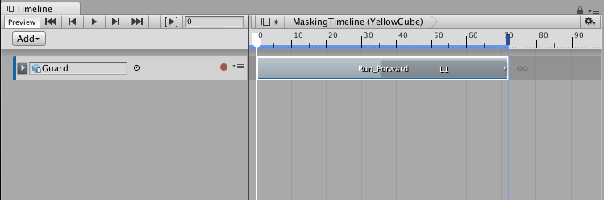
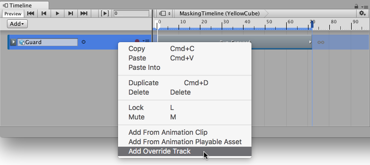
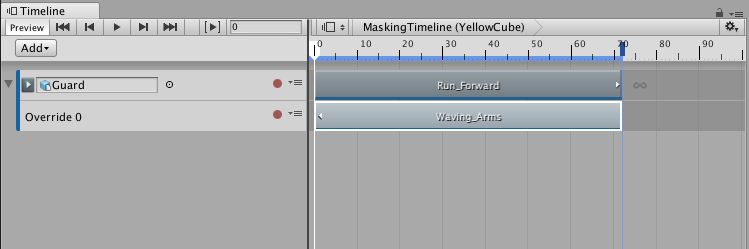
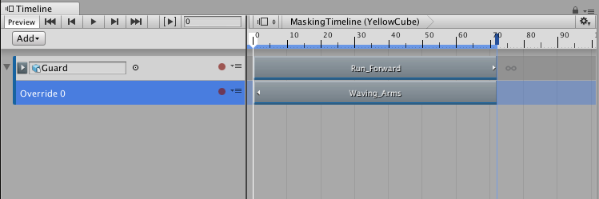
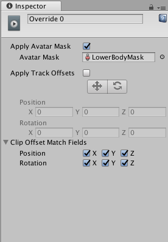
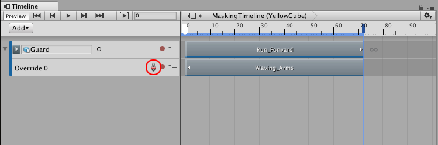
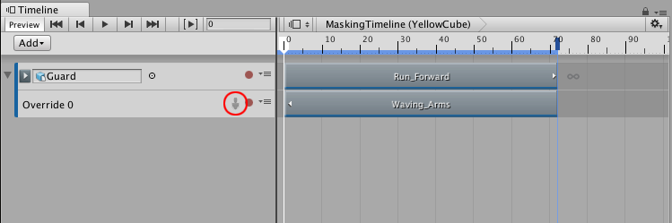

# 使用动画覆盖轨道和化身遮罩

此工作流程将演示如何使用动画覆盖轨道和化身遮罩来替换动画轨道的上半身动画。使用此技术可动画化人形角色，从而实现奔跑和携带物体等效果。

此工作流程**不介绍**如何[创建化身遮罩](class-AvatarMask.html)。此工作流程仅演示在创建时间轴实例时如何使用化身遮罩。此工作流还假定已在绑定到人形角色的动画轨道上创建了带有简单动画剪辑（例如步行或奔跑周期）的时间轴实例。

右键单击动画轨道，然后从上下文菜单中选择 Add Override Track。一个名为 Override 0 的动画覆盖轨道将链接到所选的动画轨道。请注意，动画覆盖轨道未绑定到游戏对象。由于覆盖轨道链接到上面的动画轨道，因此覆盖轨道绑定到相同的游戏对象：Guard 人形角色。

从项目中，将带有上半身动画的动画剪辑拖动到覆盖轨道中。例如，拖动静止不动并挥动手臂的人形角色的动画。根据需要定位 Waving_Arms 剪辑并调整其大小。

播放时间轴实例。Waving_Arms 剪辑完全覆盖 Run_Forward 剪辑。要将 Run_Forward 剪辑中的下半身动画与 Waving_Arms 剪辑中的上半身动画相结合，请为动画覆盖轨道指定化身遮罩。

从项目中，将化身遮罩拖动到 Inspector 窗口的 Avatar Mask 属性中。激活 Apply Avatar Mask 复选框。轨道名称旁边将显示化身遮罩 (Avatar Mask) 图标。

播放时间轴实例。在 Guard 人形角色上，上半身动画取自 Waving_Arms 剪辑，下半身动画取自 Run_Forward 剪辑。要暂时禁用化身遮罩，请单击化身遮罩图标。

---
* 2017-12-07  Page published with limited [editorial review](DocumentationEditorialReview.html)

