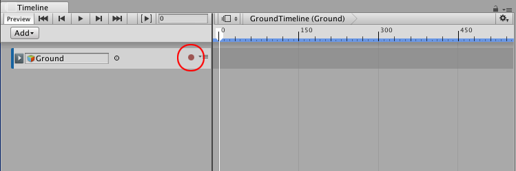
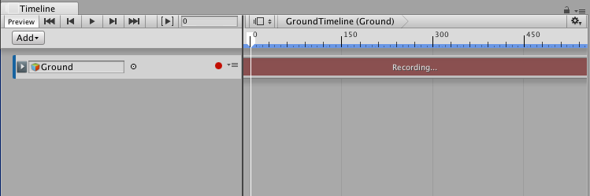
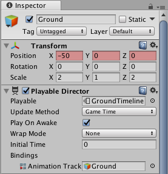
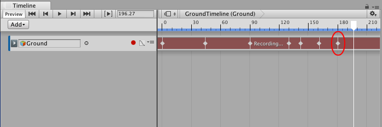
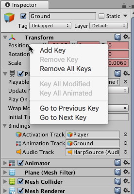
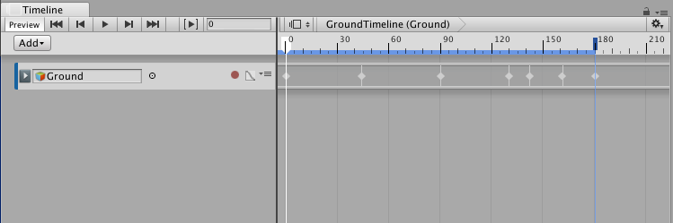
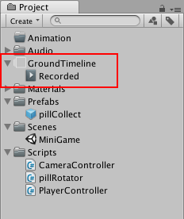

## 使用无限剪辑录制基本动画

可将动画直接录制到动画轨道。直接录制到空动画轨道时，便会创建__无限剪辑__。

无限剪辑的定义是包含通过 Timeline Editor 窗口录制的基本关键动画的剪辑。无法定位、修剪或拆分无限剪辑，因为这种剪辑没有定义的大小：其跨越整个动画轨道。

在创建无限剪辑之前，必须为要动画化的游戏对象[添加空动画轨道](TimelineAddingTracks.html)。

在轨道列表中，单击空动画轨道的 Record 按钮以启用录制模式。对于绑定到简单游戏对象（例如立方体、球体、光源等）的动画轨道，均可使用 Record 按钮。对于绑定到人形游戏对象的动画轨道，则会禁用 Record 按钮。

当轨道处于录制模式时，轨道的剪辑区域将以红色绘制并显示“Recording...”消息。Record 按钮会闪烁。

在录制模式下，对游戏对象的可动画属性的任何修改都会在时间轴播放头的位置设置一个关键点。可动画属性包括添加到游戏对象的所有组件的变换和可动画属性。

要开始创建动画，请将时间轴播放头移动到第一个关键点的位置，然后执行以下操作之一：

* 在 Inspector 窗口中，右键单击属性名称，然后选择 __Add Key__。此操作将为属性添加一个动画关键点，但不会更改其值。无限剪辑中将出现一个白色菱形以显示关键点的位置。

* 在 Inspector 窗口中，更改游戏对象的可动画属性的值。此操作将为属性添加一个动画关键点，并更改其值。无限剪辑中将出现一个白色菱形。

* 在 Scene 视图中，移动、旋转或缩放游戏对象以添加关键点。这将会自动为更改的属性添加一个关键点。无限剪辑中将出现一个白色菱形。

将播放头移动到时间轴上的其他位置，并更改游戏对象的可动画属性。在每个位置，Timeline Editor 窗口都会针对任何更改的属性向无限剪辑添加白色菱形，并为关联的动画曲线添加关键点。

在录制模式下，可右键单击一个可动画属性的名称以执行关键点操作，例如设置关键点而不更改其值，跳转到下一个或上一个关键点，删除关键点，等等。例如，要为游戏对象的位置设置一个关键点而不更改其值，请右键单击 __Position__，然后从上下文菜单中选择 __Add Key__。

完成动画后，单击闪烁的 Record 按钮可禁用录制模式。

无限剪辑在 Timeline Editor 窗口中显示为关键帧清单，但无法在此视图中编辑关键点。请使用[曲线视图编辑来关键点](TimelineEditingKeys.html)。还可以双击无限剪辑并通过 Animation 窗口来编辑关键点。

保存场景或项目以保存时间轴资源和无限剪辑。Timeline Editor 窗口将无限剪辑中的关键动画保存为源资源。源资源命名为“Recorded”并在项目中保存为时间轴资源的子项。

对于每个额外录制的无限剪辑，每个剪辑从“(1)”开始连续编号。例如，在包含三个录制无限剪辑的时间轴资源中，这些剪辑将命名为“Recorded”、“Recorded (1)”和“Recorded (2)”。如果删除某个时间轴资源，则也会删除其子剪辑。

---
* 2017-08-10  Page published with limited [editorial review](DocumentationEditorialReview.html)

