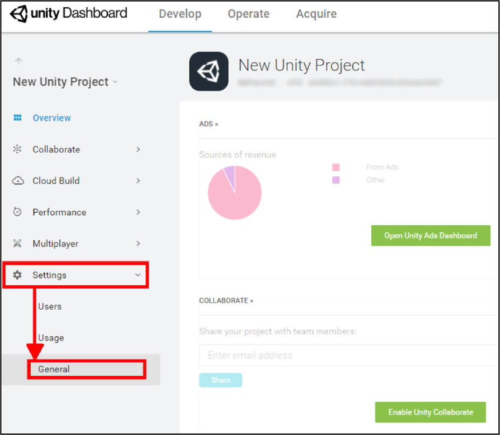
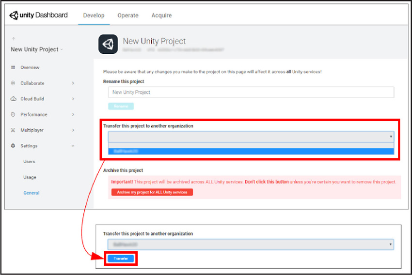

# 将项目转移到新组织

要将 Unity 项目从一个组织转移到另一个组织，您必须是这两个组织的所有者或管理员。应通过 [Unity 开发者控制面板 (Developer Dashboard)](https://developer.cloud.unity3d.com/projects/) 执行此操作。

**注意**：此过程无需禁用 Unity 服务。

从开发者控制面板 (Developer Dashboard) 的 __Projects__ 列表中，找到要转移的项目，然后选择 __View__。

在左侧导航栏上选择 __Settings__，然后从下拉选项中选择 __General__。

选择 __Transfer this project to another organization__ 下拉列表，然后从列表中选择目标组织并单击 __Transfer__。

随后将显示一条消息，指明转移是否成功。如果出现错误，请[联系 Unity 支持](https://support.unity3d.com/hc/en-us/requests/new?ticket_form_id=65905)。

---

* 2017-10-18 Page published with no [editorial review](DocumentationEditorialReview.html)

* 截至 2017-10-18，项目转移服务与 Unity 2017.1 之后的版本兼容，但是版本兼容性可能会发生变化。
