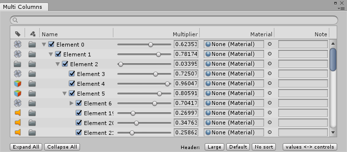

# TreeView

本页面的信息假定读者已基本了解 IMGUI（即时模式 GUI）的概念。有关 IMGUI 和自定义 Editor 窗口的信息，请参阅[扩展 Editor](ExtendingTheEditor.html) 和 [IMGUI Unity 博客](https://blogs.unity3d.com/2015/12/22/going-deep-with-imgui-and-editor-customization)。

TreeView 是一个 IMGUI 控件，用于显示可以展开和折叠的层级数据。使用 TreeView 可为 Editor 窗口创建高度定制化的列表视图和多列表格，并可将其与其他 IMGUI 控件和组件结合使用。

请参阅 Unity Scripting API 文档的 [TreeView](../ScriptReference/IMGUI.Controls.TreeView.html) 页面以了解可用的 TreeView API 函数。



请注意，TreeView 不是[树数据模型](https://en.wikipedia.org/wiki/Tree_(data_structure))。可以使用所需的任何树数据结构来构造 TreeView。这可以是 C# 树模型，也可以是基于 Unity 的树结构，如 [Transform](../ScriptReference/Transform.html) 层级视图。

为了处理 TreeView 的渲染，需要确定一个扩展项（称为行）列表。每一行代表一个 `TreeViewItem`。每个 `TreeViewItem` 都包含父子信息，此信息可供 TreeView 用来处理导航（按键和鼠标输入）。

TreeView 有一个单独的根 `TreeViewItem`，此项是隐藏的，不会出现在 Editor 中。此项是所有其他项的根。

## 重要的类和方法

除了 TreeView 本身之外，最重要的类是 [TreeViewItem](../ScriptReference/IMGUI.Controls.TreeViewItem.html) 和 [TreeViewState](../ScriptReference/IMGUI.Controls.TreeViewState.html)。

__TreeViewState__ ([TreeViewState](../ScriptReference/IMGUI.Controls.TreeViewState.html)) 包含与 Editor 中的 TreeView 字段交互时更改的状态信息，例如选择状态、展开状态、导航状态和滚动状态。`TreeViewState` 是唯一[可序列化](script-Serialization.html)的状态。TreeView 本身不可序列化，而是根据构造或重载时所代表的数据进行重建。将 `TreeViewState` 添加为 `EditorWindow` 派生类中的字段，可确保在重新加载脚本或进入播放模式时不会丢失用户更改的状态（有关如何执行此操作的信息，请参阅关于[扩展 Editor](ExtendingTheEditor.html) 的文档）。如需查看包含 `TreeViewState` 字段的类的示例，请参阅下面的[*示例 1：简单 TreeView*](#Example1)。

__TreeViewItem__ ([TreeViewItem](../ScriptReference/IMGUI.Controls.TreeViewItem.html)) 包含有关单个 TreeView 项的数据，用于在 Editor 中构建树结构的表示。每个 `TreeViewItem` 必须以唯一的整数 ID（在 TreeView 中的所有项中是唯一的）进行构造。此 ID 用于在树中查找项、选择状态、展开状态和导航。如果树表示 Unity 对象，应为每个对象使用 [GetInstanceID](../ScriptReference/Object.GetInstanceID.html) 作为 `TreeViewItem` 的 ID。在 Editor 中重新加载脚本或进入播放模式时，在 `TreeViewState` 中使用这些 ID 可以保持用户更改的状态（例如展开的项）。

所有 `TreeViewItems` 都有一个 `depth` 属性，表示视觉缩进。请参阅下面的[_初始化 TreeView_](#InitializingTreeView) 示例以了解更多信息。

__BuildRoot__ ([BuildRoot](../ScriptReference/IMGUI.Controls.TreeView.BuildRoot.html)) 是 `TreeView` 类的单个抽象方法，必须实现该方法才能创建 TreeView。使用此方法可以创建树的根项。每次对树调用 [Reload](../ScriptReference/IMGUI.Controls.TreeView.Reload.html) 时都会调用此方法。对于使用小数据集的简单树，应在 `BuildRoot` 中的根项下创建 `TreeViewItems` 的整个树。对于非常大的树，在每次重新加载时创建整个树不是最佳选择。在这种情况下，应先创建根，然后重写 `BuildRows` 方法，仅创建当前行的项。如需查看 `BuildRoot` 的用法示例，请参阅下面的[*示例 1：简单 TreeView*](#Example1)。

__BuildRows__ ([BuildRows](../ScriptReference/IMGUI.Controls.TreeView.BuildRows.html)) 是一种虚拟方法，此方法的默认实现基于 `BuildRoot` 中创建的完整树来构建行列表。如果只在 `BuildRoot` 中创建了根，则应重写此方法来处理展开的行。请参阅下面的[初始化 TreeView](#InitializingTreeView) 以了解更多信息。

 

这张图总结了 TreeView 生命周期中 `BuildRoot` 和 `BuildRows` 事件方法的排序和重复情况。请注意，每次调用 `Reload` 时都会调用一次 `BuildRoot` 方法。调用 `BuildRows` 的次数更频繁，因为在调用 `Reload` 时（在 `BuildRoot` 之后）会调用一次，而每次展开或折叠 `TreeViewItem` 时也会调用。

<a name="InitializingTreeView"> </a> 

## 初始化 TreeView

从 TreeView 对象调用 `Reload` 方法时，将初始化 TreeView。

可通过两种方法来设置 TreeView：

1.**创建完整树** - 为树模型数据中的所有项创建 `TreeViewItem`。这是默认设置，只需较少的代码即可设置。从 TreeView 对象调用 BuildRoot 时，将构建完整树。

2.**仅创建展开的项** - 这种方法要求重写 `BuildRows` 来手动控制显示的行，而 `BuildRoot` 仅用于创建根 `TreeViewItem`。这种方法最适合于大型数据集或经常更改的数据。

对于小型数据集或对于不经常更改的数据，请使用第一种方法。对大型数据集或经常更改的数据，请使用第二种方法，因为仅创建展开的项而非创建完整树的速度将更快。

可通过三种方式设置 TreeViewItem：

* 创建从头开始初始化的具有子项、父项和深度的 `TreeViewItem`。

* 创建具有父项和子项的 `TreeViewItem`，然后使用 [SetupDepthsFromParentsAndChildren](../ScriptReference/IMGUI.Controls.TreeView.SetupDepthsFromParentsAndChildren.html) 设置深度。

* 创建只有深度信息的 `TreeViewItem`，然后使用 [SetupDepthsFromParentsAndChildren](../ScriptReference/IMGUI.Controls.TreeView.SetupDepthsFromParentsAndChildren.html) 设置父项和子项引用。

## 示例

要查看下面显示的示例的项目和源代码，请下载 [TreeViewExamples.zip](http://files.unity3d.com/mads/TreeViewExamples.zip)。

<a name="Example1"> </a> 

### 示例 1：简单 TreeView

 

要创建 TreeView，请创建一个扩展 `TreeView` 类的类，并实现抽象方法 `BuildRoot`。以下示例将创建一个简单 TreeView。

```
class SimpleTreeView : TreeView
{
	public SimpleTreeView(TreeViewState treeViewState)
		: base(treeViewState)
	{
		Reload();
	}
		
	protected override TreeViewItem BuildRoot ()
	{
		// 每次调用 Reload 时都调用 BuildRoot，从而确保使用数据
		// 创建 TreeViewItem。此处，我们将创建固定的一组项。在真实示例中，
		// 应将数据模型传入 TreeView 以及从模型创建的项。

		// 此部分说明 ID 应该是唯一的。根项的深度
		// 必须为 -1，其余项的深度在此基础上递增。
		var root = new TreeViewItem {id = 0, depth = -1, displayName ="Root"};
		var allItems = new List<TreeViewItem> 
		{
			new TreeViewItem {id = 1, depth = 0, displayName = "Animals"},
			new TreeViewItem {id = 2, depth = 1, displayName = "Mammals"},
			new TreeViewItem {id = 3, depth = 2, displayName = "Tiger"},
			new TreeViewItem {id = 4, depth = 2, displayName = "Elephant"},
			new TreeViewItem {id = 5, depth = 2, displayName = "Okapi"},
			new TreeViewItem {id = 6, depth = 2, displayName = "Armadillo"},
			new TreeViewItem {id = 7, depth = 1, displayName = "Reptiles"},
			new TreeViewItem {id = 8, depth = 2, displayName = "Crocodile"},
			new TreeViewItem {id = 9, depth = 2, displayName = "Lizard"},
		};
			
		// 用于初始化所有项的 TreeViewItem.children 和 .parent 的实用方法。
		SetupParentsAndChildrenFromDepths (root, allItems);
			
		//返回树的根
		return root;
	}
}
```

此示例中使用了深度信息来构建 TreeView。最后，调用 `SetupDepthsFromParentsAndChildren` 来设置 `TreeViewItem` 的父项数据和子项数据。

请注意，可通过两种方法设置 `TreeViewItem`：直接设置父项和子项，或使用 `AddChild` 方法，如以下示例所示：

```
protected override TreeViewItem BuildRoot()
{
	var root = new TreeViewItem      { id = 0, depth = -1, displayName = "Root" };
	var animals = new TreeViewItem   { id = 1, displayName = "Animals" };
	var mammals = new TreeViewItem   { id = 2, displayName = "Mammals" };
	var tiger = new TreeViewItem     { id = 3, displayName = "Tiger" };
	var elephant = new TreeViewItem  { id = 4, displayName = "Elephant" };
	var okapi = new TreeViewItem     { id = 5, displayName = "Okapi" };
	var armadillo = new TreeViewItem { id = 6, displayName = "Armadillo" };
	var reptiles = new TreeViewItem  { id = 7, displayName = "Reptiles" };
	var croco = new TreeViewItem     { id = 8, displayName = "Crocodile" };
	var lizard = new TreeViewItem    { id = 9, displayName = "Lizard" };

	root.AddChild(animals);
	animals.AddChild(mammals);
	animals.AddChild(reptiles);
	mammals.AddChild(tiger);
	mammals.AddChild(elephant);
	mammals.AddChild(okapi);
	mammals.AddChild(armadillo);
	reptiles.AddChild(croco);
	reptiles.AddChild(lizard);

	SetupDepthsFromParentsAndChildren(root);

	return root;
}
```

#### 上面的 `SimpleTreeView` 类的替代 `BuildRoot` 方法

以下示例显示了包含 `SimpleTreeView` 的 `EditorWindow`。TreeView 以 `TreeViewState` 实例构造而成。TreeView 的实现函数应确定此视图状态的处理方式：状态是否应该持续到下一个 Unity 会话，或者是否应该仅在重新加载脚本之后（进入播放模式或重新编译脚本时）保留其状态。在此示例中，`TreeViewState` 在 `EditorWindow` 中被序列化，确保了 TreeView 在关闭并重新打开 Editor 时保留其状态。

```
using System.Collections.Generic;
using UnityEngine;
using UnityEditor.IMGUI.Controls;

class SimpleTreeViewWindow : EditorWindow
{
	// SerializeField 用于确保将视图状态写入窗口
	// 布局文件。这意味着只要窗口未关闭，即使重新启动 Unity，也会保持
	// 状态。如果省略该属性，仍然会序列化/反序列化状态。
	[SerializeField] TreeViewState m_TreeViewState;

	//TreeView 不可序列化，因此应该通过树数据对其进行重建。
	SimpleTreeView m_SimpleTreeView;

	void OnEnable ()
	{
		//检查是否已存在序列化视图状态（在程序集重新加载后
		// 仍然存在的状态）
		if (m_TreeViewState == null)
			m_TreeViewState = new TreeViewState ();

		m_SimpleTreeView = new SimpleTreeView(m_TreeViewState);
	}

	void OnGUI ()
	{
		m_SimpleTreeView.OnGUI(new Rect(0, 0, position.width, position.height));
	}

	// 将名为 "My Window" 的菜单添加到 Window 菜单
	[MenuItem ("TreeView Examples/Simple Tree Window")]
	static void ShowWindow ()
	{
		// 获取现有打开的窗口；如果没有，则新建一个窗口：
		var window = GetWindow<SimpleTreeViewWindow> ();
		window.titleContent = new GUIContent ("My Window");
		window.Show ();
	}
}
```

### 示例 2：多列 TreeView

 

此示例展示了使用 [MultiColumnHeader](../ScriptReference/IMGUI.Controls.MultiColumnHeader.html) 类的多列 TreeView。

`MultiColumnHeader` 支持以下功能：对项重命名、多选、对项重新排序、使用常规 IMGUI 控件（如滑动条和对象字段）自定义行内容、对列进行排序以及对行进行过滤和搜索。

此示例使用 `TreeElement` 和 `TreeModel` 类创建数据模型。TreeView 从此“TreeModel”获取数据。此示例中内置了 `TreeElement` 和 `TreeModel` 类来演示 TreeView 类的功能。这些类已包含在 TreeView 示例项目 ([TreeViewExamples.zip](http://files.unity3d.com/mads/TreeViewExamples.zip)) 中。此示例还显示了如何将树模型结构序列化为 [ScriptableObject](../ScriptReference/ScriptableObject.html) 并保存在资源中。

```
[Serializable]
//TreeElement 数据类已经过扩展以便保存额外数据，您可以在前端 TreeView 中显示和编辑这些数据。
internal class MyTreeElement : TreeElement
{
	public float floatValue1, floatValue2, floatValue3;
	public Material material;
	public string text = "";
	public bool enabled = true;

	public MyTreeElement (string name, int depth, int id) : base (name, depth, id)
	{
		floatValue1 = Random.value;
		floatValue2 = Random.value;
		floatValue3 = Random.value;
	}
}

```

以下 ScriptableObject 类可确保在序列化树时数据仍保留在资源中。

```
[CreateAssetMenu (fileName = "TreeDataAsset", menuName = "Tree Asset", order = 1)]
public class MyTreeAsset : ScriptableObject
{
	[SerializeField] List<MyTreeElement> m_TreeElements = new List<MyTreeElement> ();

	internal List<MyTreeElement> treeElements
	{
		get { return m_TreeElements; }
		set { m_TreeElements = value; }
	}
}
```

## 构造 MultiColumnTreeView 类

以下示例显示了 `MultiColumnTreeView` 类的代码段，说明了如何实现多列 GUI。请在 TreeView 示例项目 ([TreeViewExamples.zip](http://files.unity3d.com/mads/TreeViewExamples.zip)) 中查找完整的源代码。

```
public MultiColumnTreeView (TreeViewState state, 
                            MultiColumnHeader multicolumnHeader, 
                            TreeModel<MyTreeElement> model) 
                            : base (state, multicolumnHeader, model)
{
	// 自定义设置
	rowHeight = 20;
	columnIndexForTreeFoldouts = 2;
	showAlternatingRowBackgrounds = true;
	showBorder = true;
	customFoldoutYOffset = (kRowHeights - EditorGUIUtility.singleLineHeight) * 0.5f; 
	extraSpaceBeforeIconAndLabel = kToggleWidth;
	multicolumnHeader.sortingChanged += OnSortingChanged;
			
	Reload();
}

```

上面代码示例的自定义更改中进行了以下调整：

* `rowHeight = 20`：将默认高度（基于 [EditorGUIUtility.singleLineHeight](../ScriptReference/EditorGUIUtility-singleLineHeight.html) 的 16 点）更改为 20，为 GUI 控件增加更多空间。

* `columnIndexForTreeFoldouts = 2`：在该示例中，因为此值设置为 2，折叠箭头显示在第三列中（请参阅上图）。如果未更改此值，折叠箭头将在第一列中显示，因为默认情况下“columnIndexForTreeFoldouts”为 0。

* `showAlternatingRowBackgrounds = true`：启用交替的行背景颜色，使每行的显示更清楚。

* `showBorder = true`：在 TreeView 周围留出边距，以便显示一个细边框将其与其余内容分隔开

* `customFoldoutYOffset = (kRowHeights - EditorGUIUtility.singleLineHeight) * 0.5f`：使折叠箭头在行中垂直居中 - 请参阅下面的[自定义 GUI](#CustomizingGUI)。

* `extraSpaceBeforeIconAndLabel = 20`：在树标签前留出空间，以便显示开关按钮。

* `multicolumnHeader.sortingChanged += OnSortingChanged`：为事件分配一个方法，用于检测标题组件中排序何时发生更改（单击标题列时）以便 TreeView 的行也更改以反映排序状态。

<a name="CustomizingGUI"> </a> 

## 自定义 GUI

如果使用默认的 RowGUI 处理方法，TreeView 将看起来与上面的 `SimpleTreeView` 示例相似，只包含折叠箭头和标签。为每一项使用多个数据值时，必须重写 RowGUI 方法来显示这些值。

```
protected override void RowGUI (RowGUIArgs args)
```

以下代码示例是 `RowGUIArgs` 结构的参数结构。

```
protected struct RowGUIArgs
{
	public TreeViewItem item;
	public string label;
	public Rect rowRect;
	public int row;
	public bool selected;
	public bool focused;
	public bool isRenaming;

	public int GetNumVisibleColumns ()
	public int GetColumn (int visibleColumnIndex)
	public Rect GetCellRect (int visibleColumnIndex)
}
```

可以扩展 `TreeViewItem` 并添加更多用户数据（创建一个派生自 `TreeViewItem` 的类）。然后，可以在 RowGUI 回调中使用此用户数据。下面提供了一个这样的示例。请参阅 `override void RowGUI` - 此示例将输入项转换为 `TreeViewItem<MyTreeElement>`。

有三个与列处理相关的方法：[GetNumVisibleColumns](../ScriptReference/IMGUI.Controls.TreeView.RowGUIArgs.GetNumVisibleColumns.html)、[GetColumn](../ScriptReference/IMGUI.Controls.MultiColumnHeader.GetColumn.html) 和 [GetCellRect](../ScriptReference/IMGUI.Controls.MultiColumnHeader.GetCellRect.html)。只有在使用 [MultiColumnHeader](../ScriptReference/IMGUI.Controls.MultiColumnHeader.html) 构造 TreeView 时才能调用这些方法，否则会抛出异常。

```
protected override void RowGUI (RowGUIArgs args)
{
	var item = (TreeViewItem<MyTreeElement>) args.item;

	for (int i = 0; i < args.GetNumVisibleColumns (); ++i)
	{
		CellGUI(args.GetCellRect(i), item, (MyColumns)args.GetColumn(i), ref args);
	}
}
```

```
void CellGUI (Rect cellRect, TreeViewItem<MyTreeElement> item, MyColumns column, ref RowGUIArgs args)
{
	// 使用 EditorGUIUtility.singleLineHeight 垂直居中单元格。
// 这样可以更轻松地在单元格中放置控件和图标。
	CenterRectUsingSingleLineHeight(ref cellRect);

	switch (column)
	{

		case MyColumns.Icon1:
			
			// 绘制自定义纹理
GUI.DrawTexture(cellRect, s_TestIcons[GetIcon1Index(item)], ScaleMode.ScaleToFit);
			break;

		case MyColumns.Icon2:

//绘制自定义纹理
			GUI.DrawTexture(cellRect, s_TestIcons[GetIcon2Index(item)], ScaleMode.ScaleToFit);
			break;

		case MyColumns.Name:

			// 在标签文本的左侧创建一个开关按钮
			Rect toggleRect = cellRect;
			toggleRect.x += GetContentIndent(item);
			toggleRect.width = kToggleWidth;
			if (toggleRect.xMax < cellRect.xMax)
				item.data.enabled = EditorGUI.Toggle(toggleRect, item.data.enabled); 

			// 默认图标和标签
			args.rowRect = cellRect;
			base.RowGUI(args);
			break;

		case MyColumns.Value1:

// 显示值 1 的 Slider 控件
			item.data.floatValue1 = EditorGUI.Slider(cellRect, GUIContent.none, item.data.floatValue1, 0f, 1f);
			break;

		case MyColumns.Value2:

// 显示材质的 ObjectField
			item.data.material = (Material)EditorGUI.ObjectField(cellRect, GUIContent.none, item.data.material, 
                                          typeof(Material), false);
			break;

		case MyColumns.Value3:

// 显示数据文本字符串的 TextField
			item.data.text = GUI.TextField(cellRect, item.data.text);
			break;
	}
}
```

## 关于 TreeView 的常见问题解答

**问：在我的 TreeView 子类中有函数 [BuildRoot](../ScriptReference/IMGUI.Controls.TreeView.BuildRoot.html) 和 [RowGUI](http://treeview.rowgui)。为构建函数中添加的每个 `TreeViewItem` 都调用 `RowGUI`，还是仅针对屏幕上滚动视图中可见的项调用该方法？**

答：仅针对屏幕上可见的项调用 `RowGUI`。例如，如果有 10,000 项，仅针对屏幕上的 20 个可见项调用 `RowGUI`。

**问：我可以获取屏幕上可见行的索引吗？**

答：可以。使用 [GetFirstAndLastVisibleRows](../ScriptReference/IMGUI.Controls.TreeView.GetFirstAndLastVisibleRows.html) 方法。

**问：我可以获取 [BuildRows](../ScriptReference/IMGUI.Controls.TreeView.BuildRows.html) 中构建的行列表吗？**

答：可以。使用 [GetRows](../ScriptReference/IMGUI.Controls.TreeView.GetRows.html) 方法。

**问：任何被重写的函数都必须调用 `base.Method` 吗？**

答：仅当该方法具有要扩展的默认行为时才需要。

**问：我只想创建项列表（不是树）。必须创建根吗？**

答：是的，必须有一个根。可以创建根项并设置 `root.children = rows` 来加快设置。

**问：我已经在行中添加了一个 Toggle，为什么我点击它时，不能跳转选到这一行？**

答：默认情况下，只有在行内容不占用鼠标时才会选中该行。在这里，您的 Toggle 消耗了这个事件。要解决此问题，请在调用 Toggle 按钮之前使用 [SelectionClick](../ScriptReference/IMGUI.Controls.TreeView.SelectionClick.html) 方法。

**问：在调用所有 `RowGUI` 方法之前或之后，是否可以使用其他方法？**

答：可以。请参阅 [BeforeRowsGUI](../ScriptReference/IMGUI.Controls.TreeView.BeforeRowsGUI.html) 和 [AfterRowsGUI](../ScriptReference/IMGUI.Controls.TreeView.AfterRowsGUI.html) 的 API 文档。

**问：有没有一种简单的方法可以将按键焦点从 API 返回到 TreeView？如果我在行中选择 [FloatField](../ScriptReference/EditorGUI.FloatField.html)，该行的选择功能变为灰色。如何让它再次变蓝？**

答：蓝色表示当前具有按键焦点的行。由于 FloatField 获得了焦点，因此 TreeView 会失去焦点，所以这是预期的行为。在需要时设置 `GUIUtility.keyboardControl = treeViewControlID`。

**问：如何将 `id` 转换为 `TreeViewItem`？**

答：使用 FindItem 或 FindRows。

**问：当用户在 TreeView 中更改其选择时，我如何收到回调？**

答：重写 [SelectionChanged](../ScriptReference/IMGUI.Controls.TreeView.SelectionChanged.html) 方法（其他有用的回调：[DoubleClickedItem](../ScriptReference/IMGUI.Controls.TreeView.DoubleClickedItem.html) 和 [ContextClickedItem](../ScriptReference/IMGUI.Controls.TreeView.ContextClickedItem.html)）。
