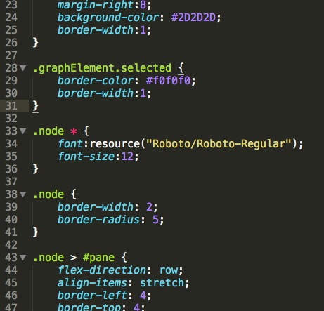
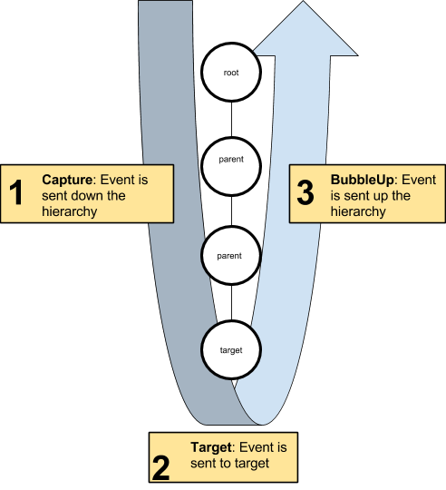
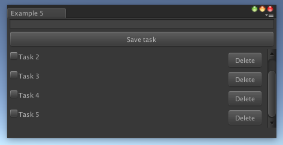

# 开始使用 UIElements

UIElements 是 Unity 2017.1 中新引入的实验性功能。

建议您在阅读本文档时查看示例项目。

示例项目位于[ https://github.com/Unity-Technologies/UIElementsExamples](https://github.com/Unity-Technologies/UIElementsExamples)。

**免责声明**：*此实验性功能不完整，以 API 为准。我们感谢您提供的任何反馈，但请注意，UIElements 仍在积极开发中。

此外，请注意 2017.2 版本中引入的更改不会应用到 2017.1 版本。*

# 简介

到目前为止，Unity Editor 用户界面主要是围绕即时模式 UI 系统构建的。虽然 IMGUI 在某些情况下很出色，但也存在一些严重的设计限制，因此会影响使用 Editor 功能的所有用户的工作效率。

这便是我们开始研究 UIElements 的动机；UIElements 是一种保留模式的 UI 的系统，它为改进性能和样式表，动态/上下文事件处理，可访问性等新功能打开了大门。

# 可视化树

可视化树 (visual tree) 是由称为“视觉元素”的轻量级节点组成的对象图。可以通过遍历这种图来实现事件处理、布局和绘制。这些节点在 C# 堆上分配（手动进行分配或将来通过资源加载的方式进行分配）。

### VisualContainer 和 VisualElement

`VisualElement` 是可视化树的所有节点的公共基类。`VisualElement` 基类包含样式、布局数据、本地变换、事件处理程序等的属性。

`VisualElement` 有若干子类，包括 `VisualContainer` 和专门的控件，它们定义了其他行为或功能。但是，并不严格要求从任何类派生其他类来使用 UIElements，因为内置的类应该包含了大多数所需的功能。

`VisualContainer` 对象包含 `VisualElement` 子对象。`VisualContainer` 类有若干方法可以处理其子项列表。

**注意**：UIElements 类当前位于 `UnityEngine.Experimental.UIElements` 命名空间内。

### 连接

新创建的元素在连接到称为**“panel”**的根对象之前会被忽略。通常需要将元素添加到现有容器对象（例如 EditorWindow.rootVisualContainer）才能将 UI 附加到面板。

**注意**：为了防止在 UIElements 处于实验性阶段时意外使用该属性，有必要仔细查看 `UnityEditor.Experimental.UIElements` 命名空间中的扩展方法 `GetRootVisualContainer()`。

为了测试 `VisualElement` 是否已连接到根，可以测试此元素的 `panel` 属性（如果未连接，则为 `null`）。

### 绘制顺序

按以下顺序绘制树的元素：

* 先绘制父项，再绘制子项

* 同级按照其父项的子项列表顺序绘制

因此，更改绘制顺序的唯一方法是在父项中重新排序 `VisualElement` 对象。

可以在 `RenderTexture` 中绘制给定的子树，并通过启用 `VisualContainer.usePixelCaching` 将像素重新用于以后的重绘事件。

**注意**：可以通过继承 `VisualElement` 并重写 DoRepaint() 方法来实现自定义绘制，但是我们不推荐这种方式，因为它会在以后的版本中改变。

### 位置、变换和坐标系

布局系统会影响每个 VisualElement.position 属性（Rect 类型）。该矩形 (rect) 表示为相对于其父项坐标空间的像素。您可以手动分配此位置，如第一个示例脚本中所示。

每个 `VisualElement` 还有一个变换属性（类型为 `Matrix4x4`），该属性从其父项空间转换其局部坐标空间（在考虑位置矩形之前）。

通过 `globalBound` 属性，同时考虑 `VisualElement` 的完整祖先的变换和位置，可以检索最终的 `VisualElement` 窗口空间坐标。

**注意**：在 2017.2 版本中，我们将通过 VisualElement 的 Translate、Rotate 和 Scale 属性来替换 `transform`，类似于 Unity 的 Transform 组件。

`VisualElementExtensions` 静态类包含若干扩展来执行坐标系之间的变换。

# 布局

`VisualElement` 和 `VisualContainer` 类包含几个用于控制布局的属性。默认情况下，所有元素都是布局的一部分，具有以下默认行为：

* 容器将垂直分配它们的子项

* 容器的位置矩形将包含其子项的矩形（除非其他布局属性对此进行了显式限制）

* 带文本的 VisualElement 将相应地自行测量其文本和大小（除非其他布局属性对此进行了显式限制）

* 默认控件还带有预定义样式，这些样式将影响其布局

UIElements 中的布局依赖于 [Yoga 开源项目](https://github.com/facebook/yoga)，该项目实现了名为 Flexbox 的 HTML/CSS 布局系统的子集。

以下是一些可帮助您开始使用 Flexbox 的资源：

* [Yoga 自有文档](https://facebook.github.io/yoga/)：属性映射几乎完全是 1 比 1

* [CSS-Tricks 的 Flexbox 指南](https://css-tricks.com/snippets/css/a-guide-to-flexbox/)：支持大多数属性，仅有一些细微差别

下面仍然给出了一份快速布局备忘单：

* 在大多数基本情况下，只需为元素分配 `width` 和 `height` 即可指定元素的大小

* 可通过 `flex` 属性指定灵活的大小，该属性作为元素相对于其同级的权重。

* 可通过将 `flexDirection` 属性分配给 Row 来切换到水平布局

* 使用相对定位可根据元素的原始布局位置来偏移元素

* 使用绝对定位可相对于元素父项位置矩形来放置元素，这种情况下不会影响其同级或父项的布局

* 通过 API 直接分配“position”属性的元素将自动视为“absolute”元素

* 为防止元素在横轴上拉伸，请将 `FlexStart` 分配给每个 `VisualElement` 子对象的 `alignSelf` 属性或父对象的 `alignItems` 属性

# 样式

`VisualElement` 具有样式属性，可以直接用 C# 语言设置这些属性，也可以从样式表中应用它们。除了布局属性之外，还有一些属性会影响元素在屏幕上的绘制方式，例如 `backgroundColor` 或 `borderColor`。

**注意**：*在 2017.2 版本中，`VisualElement` 的所有样式属性将被提取到单独的数据结构中，从而消除样式驱动属性和非样式属性之间的歧义。*

在 Unity 中通过 USS 文件格式来支持样式表。请参阅以下文档了解有关 USS 的详细信息：[Unity 样式表参考](https://docs.google.com/document/d/1uxSIJNY6zDuyM4FO_zJ8sFpcZjy6rPslmw0kqZhycbM/edit?usp=sharing)。

在 Unity 中成功创建样式表后，可通过 `AddStyleSheetPath()` 方法将样式表与 VisualContainer 相关联。

注意：

* 样式表需要放在 Assets 文件夹中的“Resources”或“Editor Default Resources”文件夹中

* 提供给上述方法的路径是相对于包含文件夹的路径

* 在运行的 `EditorWindow` 中使用样式表时，对样式表的修改会立即生效，并应该会相应地重新设置 UI 样式

* 样式表可以附加到任何 `VisualContainer`，因此它们的规则适用于此容器的所有后代

# 事件

输入事件会直接传播到 `VisualElement` 对象。根据事件类型和其他因素，逻辑会略有不同：

* 鼠标事件将传播到鼠标下的元素

* 键盘事件将传播到聚焦的元素

* 一个控件可以执行“捕获”并直接接收所有事件（例如，一个按钮在鼠标按下时执行捕获并在鼠标松开时释放）

将事件称为传播的原因是，目标对象的每个祖先可以在其后代之前（Capture 阶段）或在其后代之后（如果未停止，BubbleUp 阶段）拦截事件。您可能已熟悉 HTML 或 Flash 事件模型中的此类模式。

如果一个元素已执行捕获（通过扩展方法 `TakeCapture()`），它将直接收到事件，而不会发生传播。但是，如果它不使用该事件，事件将正常传播。

状态为 `visible` 或 `enabled` 的元素不会收到事件。但是，事件仍将在层级视图中传播。

## 添加事件处理程序

可通过两种方式编写事件处理代码：

* 重载 `VisualElement` 子类中的 `HandleEvent()` 方法

* 继承 Manipulator，并重载子类中的 `HandleEvent()` 方法，然后添加 `VisualElement.AddManipulator()`

必须根据所需的传播控制方式返回 `EventPropagation.Continue` 或 `EventPropagation.Stop`。`finalTarget` 参数将设置为目标对象。

**注意**：*在 2017.2 版本中，我们将抛弃 IMGUI Event 类，并且不再需要编写子类来处理事件。此版本将引入新事件类型以及基于回调的事件注册模型。*

## 拾取模式和自定义形状

`VisualElement` 类有一个 pickingMode 属性，该属性支持两个值：

* `PickingMode.Position`（默认值）：根据位置矩形执行拾取

* `PickingMode.Ignore`：防止因鼠标事件而被拾取

可以重载 `VisualElement.ContainsPoint()` 方法来执行自定义的交集逻辑。

# 控件

UIElements 中内置了一些标准控件：

* `Button`

* `Toggle`

* `Label`

* `ScrollView`

* `TextField` 和 `EditorTextField`

请参阅示例项目以了解控件的示例用法。

# IMGUI 支持

`IMGUIContainer` 类可让您在 `VisualElement` 内使用 IMGUI 代码。通常可在 OnGUI() 中执行的所有操作都受支持。此外，还可以通过混合 `GUILayout` 和 `UIElements` 布局来安排多个 `IMGUIContainer` 并正确排列它们。

但是，不能在 `IMGUIContainer` 中使用 UIElements。

---
* 2017-08-08  Page published with no [editorial review](DocumentationEditorialReview.html)

* Unity [2017.1](https://docs.unity3d.com/2017.1/Documentation/Manual/30_search.html?q=newin20171) 中的新功能 NewIn20171

