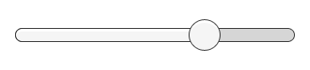
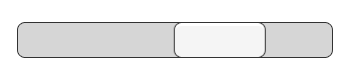

交互组件
======================

本部分将介绍 UI 系统中的交互组件，这些组件可用于处理交互，例如鼠标或触摸事件以及使用键盘或控制器进行的交互。

交互组件本身不可见，必须与一个或多个[可视元素](UIVisualComponents.html)组合才能正常工作。

##通用功能

大多数交互组件都有一些共同点。这些组件是可选择的组件，这意味着它们具有共享的内置功能，可用于对状态（正常、突出显示、按下、禁用）之间的过渡进行可视化，也可用于通过键盘或控制器导航到其他可选择的组件。[可选基类](script-Selectable.html)页面中介绍了此共享功能。

交互组件至少有一个 UnityEvent，当用户以特定方式与组件交互时将调用该 UnityEvent。UI 系统会捕获并记录从附加到 UnityEvent 的代码传出的任何异常。

##按钮 (Button)

按钮有一个 **OnClick** UnityEvent 用于定义单击按钮时将执行的操作。

 

请参阅[按钮](script-Button.html)页面以了解有关使用按钮组件的详细信息。

##开关 (Toggle)

开关有一个 **Is On** 复选框用于确定开关当前是打开还是关闭状态。当用户单击开关时，此值将反转，并可相应打开或关闭可视复选标记。按钮还有一个 **OnValueCHanged** UnityEvent 用于定义更改该值时将执行的操作。

 

请参阅[开关](script-Toggle.html)页面以了解有关使用开关组件的详细信息。

##开关组 (Toggle Group)

开关组可用于整合一组互斥的[开关](script-Toggle.html)。属于同一组的开关将受到约束，即一次只能选择其中一个开关：选择其中一个开关便会自动取消选择所有其他开关。

 

请参阅[开关组](script-ToggleGroup.html)页面以了解有关使用开关组组件的详细信息。

##滑动条 (Slider)

滑动条具有十进制**数值**，用户可以在最小值和最大值之间拖动。滑动条可以是水平或垂直的。滑动条也有一个 **OnValueChanged** UnityEvent 用于定义更改该值时将执行的操作。

 

请参阅[滑动条](script-Slider.html)页面以了解有关使用滑动条组件的详细信息。

##滚动条 (Scrollbar)

滚动条具有一个介于 0 和 1 之间的十进制**数值**。当用户拖动滚动条时，该值将相应变化。

滚动条通常与[滚动矩形 (Scroll Rect)](script-ScrollRect.html) 和[遮罩 (Mask)](script-Mask.html) 一起用于创建滚动视图。滚动条具有一个介于 0 和 1 之间的 **Size** 值，该值用于确定控制柄的大小（占整个滚动条长度的一个比例）。滚动条通常由另一个组件控制，旨在指示滚动视图中可见的内容比例。滚动矩形组件可自动执行此过程。

滚动条可以是水平或垂直的。滑动条也有一个 **OnValueChanged** UnityEvent 用于定义更改该值时将执行的操作。

 

请参阅[滚动条](script-Scrollbar.html)页面以了解有关使用滚动条组件的详细信息。

##下拉选单 (Dropdown)

下拉选单有一个可供选择的选项列表。可为每个选项指定文本字符串和可选的图像，可在 Inspector 中进行此设置，也可从代码中进行动态设置。下拉选单有一个 **OnValueChanged** UnityEvent 用于定义当更改当前选择的选项时将执行的操作。

 

请参阅[下拉选单](script-Dropdown.html)页面以了解有关使用下拉选单组件的详细信息。

##输入字段 (Input Field)

输入字段用于使[文本元素](script-Text.html)的文本可由用户编辑。输入字段有一个 UnityEvent 用于定义当更改文本内容时将执行的操作，另一个用于定义用户完成编辑后将执行的操作。

 

请参阅[输入字段](script-InputField.html)页面以了解有关使用输入字段 (Input Field) 组件的详细信息。

##滚动矩形/滚动视图 (Scroll Rect/Scroll View)

当占用大量空间的内容需要在小区域中显示时，可使用滚动矩形。滚动矩形提供了滚动此内容的功能。

通常情况下，滚动矩形与[遮罩 (Mask)](script-Mask.html) 相结合来创建滚动视图，在产生的视图中只有滚动矩形内的可滚动内容为可见状态。此外，滚动矩形还可与一个或两个可拖动以便水平或垂直滚动的[滚动条 (Scrollbar)](script-Scrollbar.html) 组合使用。

 

请参阅[滚动矩形](script-ScrollRect.html)页面以了解有关使用滚动矩形组件的详细信息。
