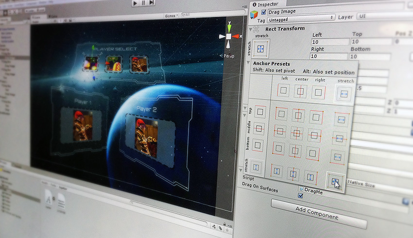

UI
===
 

UI 系统可用于快速直观地创建用户界面。本部分将介绍 Unity UI 系统的主要功能。

**相关教程：**[用户界面 (User Interface, UI)](http://unity3d.com/learn/tutorials/topics/user-interface-ui)

搜索 [Unity 知识库 (Knowledge Base)](https://support.unity3d.com/hc/en-us) 了解提示、技巧和故障排除信息。
