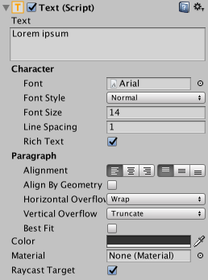

可视组件
=================

随着 UI 系统的引入，添加了各种新组件来帮助您创建 GUI 特定功能。本部分将介绍可创建的新组件的基本信息。

##文本 (Text)

 

**文本**组件也称为标签 (Label)，有一个文本区域可用于输入要显示的文本。可以设置字体、字体样式、字体大小以及文本是否支持富文本功能。

有一些选项可以设置文本的对齐方式、水平和垂直溢出的设置（控制文本大于矩形的宽度或高度时会发生什么情况）以及一个使文本调整大小来适应可用空间的 Best Fit 选项。

##图像 (Image)

 

图像具有矩形变换组件和**图像**组件。可在 Target Graphic 字段下将精灵应用于图像组件，并可在 Color 字段中设置其颜色。还可将材质应用于图像组件。Image Type 字段可定义应用的精灵的显示方式，提供的选项包括：

* **Simple** - 均匀缩放整个精灵。

* **Sliced** - 使用 3x3 精灵分区，确保大小调整不会扭曲角点，而是仅拉伸中心部分。

* **Tiled** - 类似于 Sliced，但平铺（重复）中心部分而不是对其进行拉伸。对于完全没有边框的精灵，整个精灵都是平铺的。

* **Filled** - 按照与 Simple 相同的方式显示精灵，但不同之处是使用定义的方向、方法和数量从原点开始填充精灵。

选择 Simple 或 Filled 时显示的 Set Native Size 选项会将图像重置为原始精灵大小。

通过从“Texture Type”设置中选择 Sprite (2D/UI)，可以将图像导入为 **UI 精灵**。与旧的 GUI 精灵相比，现在的精灵有额外的导入设置，最大的区别是增加了 Sprite Editor（精灵编辑器）。Sprite Editor 提供图像 **9 切片**选项，此选项将图像分成 9 个区域，如此一来，如果精灵调整大小，角点就不会拉伸或扭曲。

 

##原始图像 (Raw Image)

图像组件采用精灵，但**原始图像**采用纹理（无边框等）。只有在必要时才应使用原始图像，否则大多数情况都适合使用图像。

##遮罩 (Mask)

遮罩不是可见的 UI 控件，而是一种修改控件子元素外观的方法。遮罩将子元素限制（即“掩盖”）为父元素的形状。因此，如果子项比父项大，则子项仅包含在父项以内的部分才可见。

##效果

可视组件也可应用各种简单效果，例如简单的投射阴影或轮廓。请参阅 [UI 效果](comp-UIEffects.html)参考页面以了解更多信息。

