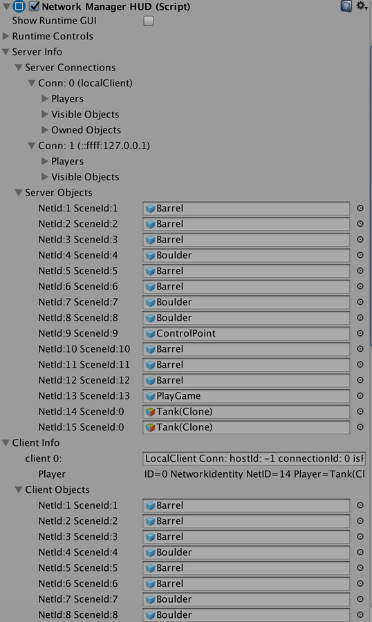
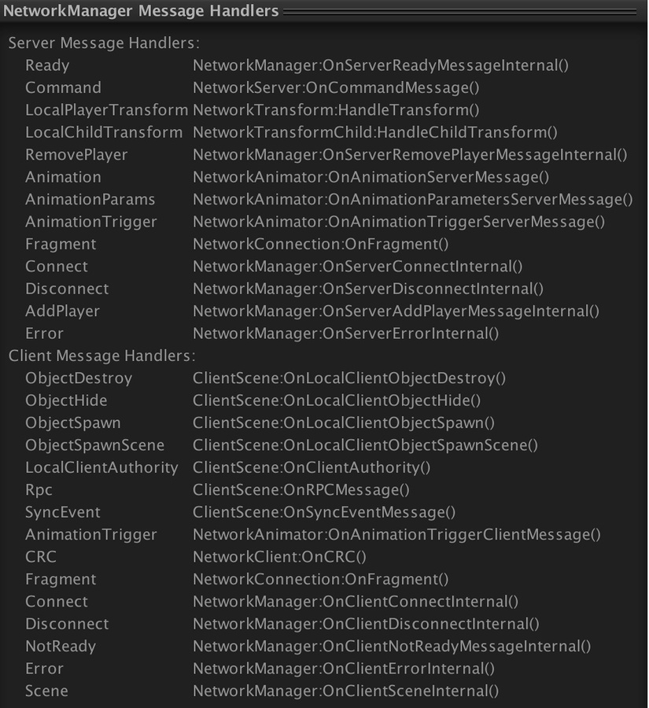

#调试信息

Unity 提供了若干工具在运行时获取游戏的相关信息。这些信息对于测试多人游戏很有用。

当游戏在 Editor 中以播放模式运行时，Network Manager HUD Inspector 将显示有关运行时网络状态的额外信息。这些信息包括：

* 网络连接

* 服务器上的包含 [Network Identity](https://docs.unity3d.com/Manual/class-NetworkIdentity.html) 组件的活动游戏对象

* 客户端上的包含 Network Identity 组件的活动游戏对象

* 对等客户端

此外，Network Manager 预览面板（在 Inspector 窗口底部）将列出已注册的消息回调处理程序。

