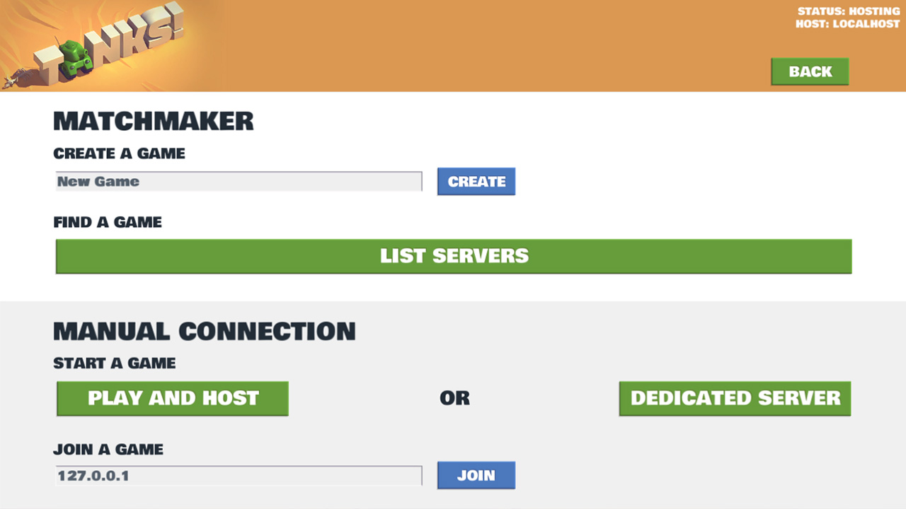
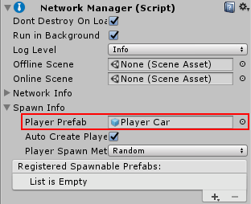

# 设置多人游戏项目

本页面概要介绍设置多人游戏项目时所需的最基本和最常见的事项。在项目的需求方面包括：

* **Network Manager**

* **用户界面**（供玩家查找和加入游戏）

* 联网**玩家预制件**（供玩家控制）

* 具有**多人游戏感知功能**的脚本和游戏对象

根据具体情况，此列表可能会有所变化；例如，在多人国际象棋游戏或实时战略 (RTS) 游戏中，不需要可见的游戏对象来表示玩家。但是，可能仍然需要一个不可见的空游戏对象来表示玩家，并附加一个与玩家操作相关的脚本。

本介绍页面包含上面列出的每一项的简要说明。但是，每个部分都链接到更详细的文档，您需要继续阅读以完全理解它们。

在构建游戏时，还需要了解一些重要概念并做出相应选择。这些概念大体上可概括为：

* **客户端**、**服务器**和**主机**之间的关系

* 对游戏对象和操作的**授权**概念

要了解有关这些概念的信息，请参阅[网络系统概念](UNetConcepts.html)文档。

## Network Manager

Network Manager 负责管理多人游戏的网络方面。同一时间应在场景中激活一个（且仅一个）Network Manager。

Unity 的内置 Network Manager 组件将用于管理多人游戏的所有功能整合到一个组件中。如果您有一些自定义要求，而此组件未涵盖这些要求，则可以使用脚本编写自己的 Network Manager 来代替此组件。如果刚开始了解多人游戏，应使用这个组件。

有关详细信息，请参阅 [Network Manager](UNetManager.html) 的文档。

## 供玩家查找和加入游戏的用户界面

几乎每个多人游戏都为玩家提供了发现、创建和加入单个游戏“实例”（也称为“比赛”）的方法。游戏的这一部分通常称为“大厅”，有时还有聊天等额外功能。

对于这种界面，Unity 有一个极其基本的内置版本，称为 NetworkManagerHUD。此界面在创建游戏的早期阶段非常有用，因为可以轻松创建比赛并测试游戏，而无需实现自己的 UI。但是，此界面在功能和视觉设计方面都非常简单，因此在完成项目之前，应该用自己的 UI 进行替换。

有关详细信息，请参阅 [Network Manager HUD](UNetManagerHUD.html.html) 的文档。

## 联网玩家游戏对象

大多数多人游戏都具有玩家可以控制的某种对象，如角色、汽车或其他对象。一些多人游戏不具有单个可见的“玩家对象”，而是允许玩家控制许多单元或物品，例如在国际象棋或实时战略游戏中就是如此。其他一些游戏甚至根本没有特定的对象，比如共享画布的绘画游戏。但是，在所有这些情况下，通常需要创建一个*概念上*代表游戏玩家的游戏对象。应将此游戏对象作为[预制件](Prefabs.html)，并将所有脚本附加到此预制件上，从而控制玩家在游戏中可以执行的操作。

如果使用 Unity Network Manager 组件（请参阅上面的 *Network Manager*），请将该预制件分配给 **Player Prefab** 字段。

当游戏运行时，Network Manager 会为连接到比赛的每个玩家创建玩家预制件的副本（“实例”）。

但是（对于刚接触多人游戏编程的人来说，这也是令人困惑的地方），需要确保玩家预制件实例上的脚本“知道”控制该实例的玩家是在使用**主机**计算机（管理游戏的计算机）还是使用**客户端**计算机（与管理游戏的计算机不同的计算机）。

这是因为两种情况会同时发生。

## 多人游戏感知脚本

为多人游戏编写脚本不同于为单人游戏编写脚本。原因在于，在为多人游戏编写脚本时，需要考虑脚本运行的不同上下文。要了解此处讨论的网络概念，请参阅有关[网络系统概念](UNetConcepts.html)的文档。

例如，放置在玩家预制件上的脚本应允许该玩家实例的“所有者”控制该实例，但不应允许其他人对其进行控制。

需要考虑服务器或客户端是否具有对脚本功能的授权。有时，可能希望脚本同时在服务器和客户端上运行。而其他时候，可能只希望脚本在服务器上运行，并只希望客户端复制游戏对象的移动方式（例如，在玩家拾取可收集的游戏对象的游戏中，该脚本应仅在服务器上运行，这样服务器就能掌控收集的游戏对象数量）。

根据脚本的功能，需要确定脚本的哪些部分应在哪些情况下激活。

对于玩家游戏对象，每个人通常都能主动控制自己的玩家实例。这意味着每个客户端都对自己的玩家具有本地授权，并且服务器接受客户端告知的该玩家正在执行的操作。

对于非玩家游戏对象，服务器通常对发生的操作（例如是否已收集物品）具有控制权，并且所有客户端都接受服务器告知的该游戏对象发生的操作。

