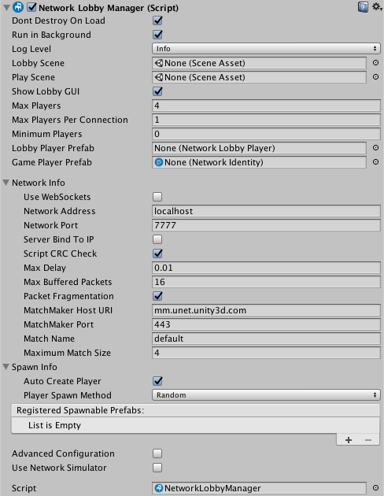

# 多人游戏大厅

大多数多人游戏都有“大厅”，即游戏中的场景，供玩家在玩实际游戏之前加入。在大厅，玩家可以选择选项并准备好让游戏开始。

Unity 提供了 [Network Lobby Manager 组件](class-NetworkLobbyManager.html)用于轻松实现游戏大厅。

Network Lobby Manager 组件为 Unity 多人游戏提供一个大厅。该组件包括以下功能：

* 一个简单的内置用户界面，用于与大厅互动
* 限制可以加入的玩家数量
* 支持每个客户端有多个玩家，但每个客户端的玩家数量存在限制
* 阻止玩家加入正在进行中的游戏
* 支持客户端的“就绪”状态，使游戏在所有玩家都准备就绪时开始
* 每个玩家的配置数据
* 玩家在游戏结束后重新加入大厅
* 虚拟函数，允许使用自定义逻辑处理大厅事件

以下是 Network Lobby Manager 虚拟方法。有关更多详细信息，请参阅 [NetworkLobbyManager](../ScriptReference/Networking.NetworkLobbyManager.html) 类的 API 参考文档。有一个单独的列表列出了在客户端和服务器上调用的方法。您可以为这些方法编写自己的实现，以便在发生任何这些事件时采取措施。


在**服务器**上调用的 `NetworkLobbyManager` 虚拟方法：

* [OnLobbyStartHost](../ScriptReference/Networking.NetworkLobbyManager.OnLobbyStartHost.html)
* [OnLobbyStopHost](../ScriptReference/Networking.NetworkLobbyManager.OnLobbyStopHost.html)
* [OnLobbyStartServer](../ScriptReference/Networking.NetworkLobbyManager.OnLobbyStartServer.html)
* [OnLobbyServerConnect](../ScriptReference/Networking.NetworkLobbyManager.OnLobbyServerConnect.html)
* [OnLobbyServerDisconnect](../ScriptReference/Networking.NetworkLobbyManager.OnLobbyServerDisconnect.html)
* [OnLobbyServerSceneChanged](../ScriptReference/Networking.NetworkLobbyManager.OnLobbyServerSceneChanged.html)
* [OnLobbyServerCreateLobbyPlayer](../ScriptReference/Networking.NetworkLobbyManager.OnLobbyServerCreateLobbyPlayer.html)
* [OnLobbyServerCreateGamePlayer](../ScriptReference/Networking.NetworkLobbyManager.OnLobbyServerCreateGamePlayer.html)
* [OnLobbyServerPlayerRemoved](../ScriptReference/Networking.NetworkLobbyManager.OnLobbyServerPlayerRemoved.html)
* [OnLobbyServerSceneLoadedForPlayer](../ScriptReference/Networking.NetworkLobbyManager.OnLobbyServerSceneLoadedForPlayer.html)
* [OnLobbyServerPlayersReady](../ScriptReference/Networking.NetworkLobbyManager.OnLobbyServerPlayersReady.html)

在**客户端**上调用的 `NetworkLobbyManager` 虚拟方法：

* [OnLobbyClientEnter](../ScriptReference/Networking.NetworkLobbyManager.OnLobbyClientEnter.html)
* [OnLobbyClientExit](../ScriptReference/Networking.NetworkLobbyManager.OnLobbyClientExit.html)
* [OnLobbyClientConnect](../ScriptReference/Networking.NetworkLobbyManager.OnLobbyClientConnect.html)
* [OnLobbyClientDisconnect](../ScriptReference/Networking.NetworkLobbyManager.OnLobbyClientDisconnect.html)
* [OnLobbyStartClient](../ScriptReference/Networking.NetworkLobbyManager.OnLobbyStartClient.html)
* [OnLobbyStopClient](../ScriptReference/Networking.NetworkLobbyManager.OnLobbyStopClient.html)
* [OnLobbyClientSceneChanged](../ScriptReference/Networking.NetworkLobbyManager.OnLobbyClientSceneChanged.html)
* [OnLobbyClientAddPlayerFailed](../ScriptReference/Networking.NetworkLobbyManager.OnLobbyClientAddPlayerFailed.html)

所有上述服务器和客户端方法都有空的默认实现，但 `OnLobbyServerPlayersReady**`** 除外，此方法使用 PlayScene（在 Lobby Manager Inspector 中的 __Play Scene__ 字段中分配的场景）调用 [ServerChangeScene](../ScriptReference/Networking.NetworkManager.ServerChangeScene.html)。

## 大厅玩家游戏对象

Lobby Manager 有两种玩家预制件：**大厅玩家预制件 (Lobby Player Prefab)** 和**游戏玩家预制件 (Game Player Prefab)**。在 Network Lobby Manager 组件中，每个预制件都有一个字段。

 

Network Lobby Manager 组件

### Lobby Player Prefab

分配给 **Lobby Player Prefab** 字段的预制件必须附加 [Network Lobby Player 组件](class-NetworkLobbyPlayer.html)。加入大厅的每个客户端都会获得一个从 **Lobby Player Prefab** 创建的新大厅玩家游戏对象。Unity 在客户端连接时（即有玩家加入游戏时）创建大厅玩家游戏对象，该游戏对象在客户端断开连接之前将一直存在。

Network Lobby Player 组件为每个玩家保持“就绪”状态，并在大厅中处理命令。可将用户脚本添加到预制件来保存游戏特定的玩家数据。

Network Lobby Player 组件提供了一些可用于自定义大厅行为的虚拟方法回调。如下：

```
public virtual void OnClientEnterLobby();
public virtual void OnClientExitLobby();
public virtual void OnClientReady(bool readyState); 
```

游戏进入大厅时，Unity 会在客户端上调用 [OnClientEnterLobby](../ScriptReference/Networking.NetworkLobbyPlayer.OnClientEnterLobby.html) 方法。大厅场景第一次启动时以及从游戏场景返回大厅时，都会发生此调用。

游戏离开大厅时，Unity 会在客户端上调用 [OnClientExitLobby](../ScriptReference/Networking.NetworkLobbyPlayer.OnClientExitLobby.html) 方法。切换到游戏场景时会发生此调用。

该玩家的就绪状态发生变化时，Unity 会在客户端上调用 [OnClientReady](../ScriptReference/Networking.NetworkLobbyPlayer.OnClientReady.html) 方法。

### Game Player Prefab

当所有玩家都表明他们已准备就绪时，游戏将开始。游戏开始时，Unity 会根据 **Game Player Prefab** 为每个玩家创建一个游戏对象。游戏结束后玩家重新进入大厅时，Unity 会销毁这些游戏对象。**Game Player Prefab** 在游戏中处理命令。此预制件是标准的联网游戏对象，并且必须附加 [Network Identity 组件](class-NetworkIdentity.html)。

## Minimum Players

在 Network Lobby Manager 组件上，**Minimum Players** 字段表示在游戏开始之前需要指示已准备就绪的最少玩家数量。如果连接的客户端数量达到 **Minimum Players** 的值，则等到所有连接的客户端都变为“就绪”后才会开始比赛。

例如，如果“Minimum Players”设置为 2：

* 启动游戏的一个实例，并以主机模式开始游戏。然后，在游戏的大厅界面中，为玩家按下“Start”。此时您仍然在大厅，因为开始游戏的最少就绪玩家数量为 2。
* 启动游戏的另外两个实例，并在这些实例中以客户端模式开始这些游戏。等待所有连接的玩家（在此示例中为三个）准备就绪。
为一名玩家在大厅 UI 中按下“Start”。现在，两个玩家已准备就绪，但仍在大厅。为最后一名玩家在大厅 UI 中按下“Start”。所有玩家都将移到主游戏场景。

## 为游戏添加大厅

以下步骤概述了使用 Unity 的内置网络功能为多人游戏添加网络大厅的基本过程：

* 为大厅创建一个新场景
* 将该场景添加到 Build Settings (**File** > **Build Settings…** > **Add Open Scenes**) 作为第一个场景
* 在新场景中创建一个新的游戏对象，并将其重命名为 *LobbyManager*
* 将 Network Lobby Manager 组件添加到 *LobbyManager* 游戏对象
* 将 Network Manager HUD 组件添加到 *LobbyManager* 游戏对象
* 打开 Network Lobby Manager 组件的 Inspector
* 在 Network Lobby Manager 中，将 **Lobby Scene** 设置为包含 *LobbyManager* 游戏对象的场景
* 在 Network Lobby Manager 中，将 **Play Scene** 设置为游戏的主游戏场景
* 创建一个新的游戏对象，并将其重命名为 *LobbyPlayer*
* 将 Network Lobby Player 组件添加到 *LobbyPlayer*
* 为 *LobbyPlayer* 游戏对象创建一个预制件，并从场景中删除该实例
* 将 LobbyPlayerPrefab 字段（在 Network Lobby Manager Inspector 中）设置为 *LobbyPlayer* 预制件
* 将 GamePlayerPrefab 字段（在 Network Lobby Manager Inspector 中）设置为主游戏中玩家的预制件
* 保存场景
* 运行游戏

此版本的 Network Lobby Manager 是一个非常简单的实现，并使用占位的用户界面，在很大程度上就像 Network Manager HUD 一样。在发布游戏之前，应该此界面替换为您自己的用户界面，确保符合游戏视觉设计和功能要求。

如需查看出色的用户界面的示例，请参阅 Asset Store 上提供的[多人游戏大厅资源包]((https://www.assetstore.unity3d.com/en/#!/content/41836)。

[NetworkLobbyManager](../ScriptReference/Networking.NetworkLobbyManager.html) 类具有许多用于自定义大厅行为的虚拟函数回调。最重要的函数是 [OnLobbyServerSceneLoadedForPlayer](../ScriptReference/Networking.NetworkLobbyManager.OnLobbyServerSceneLoadedForPlayer.html)；当每个玩家从大厅转换到主游戏时，都会在服务器上调用此函数。这是将大厅游戏对象中的设置应用到玩家游戏对象的理想位置。

```
    // 供用户将其大厅玩家游戏对象中的设置应用于他们的游戏内玩家游戏对象
        public override bool OnLobbyServerSceneLoadedForPlayer(GameObject lobbyPlayer, GameObject gamePlayer)
        {
            var cc = lobbyPlayer.GetComponent<ColorControl>();
            var player = gamePlayer.GetComponent<Player>();
            player.myColor = cc.myColor;
            return true;
        }
```

## 示例项目

**Unity Asset Store** 上有一个示例项目使用 Network Lobby Manager 并为大厅提供了 GUI。您可以参考此示例项目为自己的多人游戏制作自己的大厅。请参阅 [Asset Store：大厅示例项目](https://www.assetstore.unity3d.com/en/#!/content/41836)。

