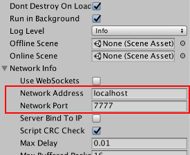

# 使用 Network Manager

**Network Manager** 是用于管理多人游戏的网络方面的组件。

Network Manager 功能包括：

* 游戏状态管理

* 生成管理

* 场景管理

* 调试信息

* 配对

* 自定义

## 开始使用 Network Manager

Network Manager 是多人游戏的核心控制组件。首先，在起始场景中创建一个空游戏对象，然后添加 NetworkManager 组件。新添加的 Network Manager 组件如下所示：


Editor 中的 Network Manager Inspector 可用于配置和控制与网络相关的许多设置。

**注意**：每个场景中只应有一个激活的 Network Manager。不要将 Network Manager 组件放在联网游戏对象（具有 [Network Identity](class-NetworkIdentity.html) 组件的游戏对象）上，因为 Unity 会在加载场景时禁用这些组件。

如果您已经熟悉多人游戏开发，可能会发现完全使用[高级 API](UNetUsingHLAPI.html) (HLAPI) 实现 Network Manager 组件很有用，因为这样就能通过脚本执行该组件的全部功能。如果您是高级用户，想要扩展 Network Manager 组件的功能，则可以使用脚本从 NetworkManager 派生自己的类，并通过覆盖其提供的任何虚拟函数挂钩来自定义其行为。但是，Network Manager 组件将许多有用的功能整合到一个地方，并使创建、运行和调试多人游戏的过程尽可能简单。

## 游戏状态管理

网络多人游戏可在三种模式下运行，即作为客户端、作为专用服务器或作为“主机”（同时充当客户端和服务器）。

如果使用 [Network Manager HUD](class-NetworkManagerHUD.html) 组件，该组件会根据玩家选择的选项自动告知 Network Manager 启动哪种模式。如果要自己编写允许玩家启动游戏的 UI，必须使用自己的代码调用这些 UI。这些方法是：

* [NetworkManager.StartClient](../ScriptReference/Networking.NetworkManager.StartClient.html)

* [NetworkManager.StartServer](../ScriptReference/Networking.NetworkManager.StartServer.html)

* [NetworkManager.StartHost](../ScriptReference/Networking.NetworkManager.StartHost.html)



无论游戏以何种模式（客户端、服务器还是主机）启动，都会使用 **Network Address** 和 **Network Port** 属性。在客户端模式下，游戏尝试连接到指定的地址和端口。在服务器或主机模式下，游戏会监听指定端口上的传入连接。

在开发游戏期间，为这些属性指定固定地址和端口设置会很有用。但是，最终可能希望玩家能够选择他们要连接的主机。到达该阶段时，可使用 [Network Discovery](class-NetworkDiscovery.html) 组件（请参阅[本地发现](UNetDiscovery.html)）在局域网 (LAN) 上广播和查找地址和端口，并可为玩家使用 Matchmaker 服务来查找要连接到的互联网比赛（请参阅 [Multiplayer 服务](UnityMultiplayerService.html)）。

## 生成管理

使用 Network Manager 可管理基于预制件的联网游戏对象生成（联网实例化）。


大多数游戏都有一个代表玩家的预制件，因此 Network Manager 有一个 **Player Prefab** 字段。应为此字段分配玩家预制件。设置玩家预制件后，该预制件将用于为游戏中的每个用户自动生成玩家游戏对象。该机制适用于托管服务器上的本地玩家和远程客户端上的远程玩家。必须将 [Network Identity](class-NetworkIdentity.html) 组件附加到玩家预制件。

分配玩家预制件后，即可作为主机开始游戏，并看到玩家游戏对象生成。停止游戏会销毁玩家游戏对象。如果构建并运行另一个游戏副本并将其作为客户端连接到 *localhost*，则 Network Manager 会使另一个玩家游戏对象出现。停止该客户端时会销毁该玩家的游戏对象。

除了玩家预制件之外，还必须向 Network Manager 注册要在游戏过程中动态生成的其他预制件。

可将预制件添加到 Inspector 中标记为 **Registered Spawnable Prefabs** 的列表。还可使用 [ClientScene.RegisterPrefab()](../ScriptReference/Networking.ClientScene.RegisterPrefab.html) 方法通过代码来注册预制件。

如果只有一个 Network Manager，则需要向其注册可能在任何场景中生成的所有预制件。如果每个场景中都有单独的 Network Manager，则只需注册与该场景相关的预制件。

### 自定义玩家实例化

Network Manager 使用其 [NetworkManager.OnServerAddPlayer()](../ScriptReference/Networking.NetworkManager.OnServerAddPlayer.html) 实现来生成玩家游戏对象。如果要自定义玩家游戏对象的创建方式，可重写该虚拟函数。以下代码显示了默认实现的示例：

```

public virtual void OnServerAddPlayer(NetworkConnection conn, short playerControllerId)
{
    var player = (GameObject)GameObject.Instantiate(playerPrefab, playerSpawnPos, Quaternion.identity);
    NetworkServer.AddPlayerForConnection(conn, player, playerControllerId);
} 
```

**注意：**如果要实现 OnServerAddPlayer 的自定义版本，必须为新创建的玩家游戏对象调用 [NetworkServer.AddPlayerForConnection()](../ScriptReference/Networking.NetworkServer.AddPlayerForConnection.html) 方法，以便生成该游戏对象并与客户端的连接关联。AddPlayerForConnection 会生成游戏对象，因此无需使用 [NetworkServer.Spawn()](../ScriptReference/Networking.NetworkServer.Spawn.html)。

## 开始位置

要控制玩家的生成位置，可使用 [Network Start Position](class-NetworkStartPosition.html) 组件。要使用 Network Start Position 组件，请将其附加到场景中的游戏对象，并将该游戏对象放置在希望某一个玩家开始的位置。可根据需要为场景添加任意数量的起始位置。Network Manager 会检测场景中的所有起始位置，并在生成每个玩家实例时使用其中一个位置和方向。

Network Manager 具有 **Player Spawn Method** 属性，用于配置如何选择起始位置。

* 选择 **Random** 可根据随机选择的 startPosition 选项生成玩家。

* 选择 **Round Robin** 可循环使用预设列表中的 startPosition 选项。

如果 Random 或 Round Robin 模式不符合游戏需求，可使用代码自定义如何选择起始位置。可通过 [NetworkManager.startPositions](../ScriptReference/Networking.NetworkManager-startPositions.html) 列表访问可用的 Network Start Position 组件，并可使用 Network Manager 上的 helper 方法 [GetStartPosition()](../ScriptReference/Networking.NetworkManager.GetStartPosition.html)，该方法可用于实现 OnServerAddPlayer 以便查找起始位置。

## 场景管理

大多数游戏都有多个场景。至少，除了实际进行游戏的场景之外，通常还有标题屏幕或开始菜单场景。Network Manager 旨在以适合多人游戏的方式自动管理场景状态和场景转换。

NetworkManager Inspector 上有两个用于场景的字段：Offline Scene 和 Online Scene。将场景资源拖动到这些字段中可激活联网场景管理。

启动服务器或主机时将加载联机场景 (Online Scene)。然后，此场景将成为当前的网络场景。连接到该服务器的所有客户端都被要求也加载此场景。此场景的名称存储在 [networkSceneName](../ScriptReference/Networking.NetworkManager-networkSceneName.html) 属性中。


网络停止（通过停止服务器或主机或者通过断开客户端连接）时将加载脱机场景 (Offline Scene)。因此，游戏在与多人游戏断开连接时会自动返回菜单场景。

还可以通过调用 [NetworkManager.ServerChangeScene()](../ScriptReference/Networking.NetworkManager.ServerChangeScene.html) 在游戏处于活动状态时更改场景。这样也会使所有当前连接的客户端改变场景，并更新 networkSceneName，让新客户端也能加载新场景。

当联网场景管理处于激活状态时，对游戏状态管理函数（如 NetworkManager.StartHost() 或 NetworkManager.StopClient()）的任何调用都可能导致场景改变。此规则适用于运行时控件 UI。通过设置场景并调用这些方法，可控制多人游戏的流程。

请注意，场景改变会导致前一个场景中的所有游戏对象都被销毁。

通常应确保 Network Manager 在场景之间保持不变，否则在场景改变时网络连接会中断。为此，请确保在 Inspector 内选中 **Don’t Destroy On Load** 复选框。但是，也可在每个场景中使用具有不同设置的单独 Network Manager，如果希望控制增量预制件加载或不同的场景转换，可能会很有用。

## 自定义

NetworkManager 类上有一些可自定义的虚拟函数；您可以通过自行创建继承自 NetworkManager 的派生类来自定义这些函数。实现这些函数时，请务必注意默认实现所提供的功能。例如，在 OnServerAddPlayer() 中，必须调用函数 NetworkServer.AddPlayer 来激活要连接的玩家游戏对象。

以下是主机/服务器和客户端可能发生的所有回调，在某些情况下，调用基类函数来维持默认行为很重要。要查看实现本身，可在 [Bitbucket Networking 代码仓库](https://bitbucket.org/Unity-Technologies/networking)中进行查看。

```

using UnityEngine;

using UnityEngine.Networking;

using UnityEngine.Networking.Match;

public class CustomManager : NetworkManager {

    // 服务器回调

    public override void OnServerConnect(NetworkConnection conn) {

        Debug.Log("A client connected to the server: " + conn);

    }

    public override void OnServerDisconnect(NetworkConnection conn) {

        NetworkServer.DestroyPlayersForConnection(conn);

        if (conn.lastError != NetworkError.Ok) {

            if (LogFilter.logError) { Debug.LogError("ServerDisconnected due to error: " + conn.lastError); }

        }

        Debug.Log("A client disconnected from the server: " + conn);

    }

    public override void OnServerReady(NetworkConnection conn) {

        NetworkServer.SetClientReady(conn);

        Debug.Log("Client is set to the ready state (ready to receive state updates): " + conn);

    }

    public override void OnServerAddPlayer(NetworkConnection conn, short playerControllerId) {

        var player = (GameObject)GameObject.Instantiate(playerPrefab, Vector3.zero, Quaternion.identity);

        NetworkServer.AddPlayerForConnection(conn, player, playerControllerId);

        Debug.Log("Client has requested to get his player added to the game");

    }

    public override void OnServerRemovePlayer(NetworkConnection conn, PlayerController player) {

        if (player.gameObject != null)

            NetworkServer.Destroy(player.gameObject);

    }

    public override void OnServerError(NetworkConnection conn, int errorCode) {

        Debug.Log("Server network error occurred: " + (NetworkError)errorCode);

    }

    public override void OnStartHost() {

        Debug.Log("Host has started");

    }

    public override void OnStartServer() {

        Debug.Log("Server has started");

    }

    public override void OnStopServer() {

        Debug.Log("Server has stopped");

    }

    public override void OnStopHost() {

        Debug.Log("Host has stopped");

    }

    // 客户端回调

    public override void OnClientConnect(NetworkConnection conn)

    {

        base.OnClientConnect(conn);

        Debug.Log("Connected successfully to server, now to set up other stuff for the client...");

    }

    public override void OnClientDisconnect(NetworkConnection conn) {

        StopClient();

        if (conn.lastError != NetworkError.Ok)

        {

            if (LogFilter.logError) { Debug.LogError("ClientDisconnected due to error: " + conn.lastError); }

        }

        Debug.Log("Client disconnected from server: " + conn);

    }

    public override void OnClientError(NetworkConnection conn, int errorCode) {

        Debug.Log("Client network error occurred: " + (NetworkError)errorCode);

    }

    public override void OnClientNotReady(NetworkConnection conn) {

        Debug.Log("Server has set client to be not-ready (stop getting state updates)");

    }

    public override void OnStartClient(NetworkClient client) {

        Debug.Log("Client has started");

    }

    public override void OnStopClient() {

        Debug.Log("Client has stopped");

    }

    public override void OnClientSceneChanged(NetworkConnection conn) {

        base.OnClientSceneChanged(conn);

        Debug.Log("Server triggered scene change and we've done the same, do any extra work here for the client...");

    }

}

```


NetworkManager Inspector 提供了更改某些连接参数和超时的功能。有些参数未在此处公开，但可以通过代码更改这些参数。

```

using UnityEngine;

using UnityEngine.Networking;

public class CustomManager : NetworkManager {

    // 尽早设置自定义连接参数，确保不会太晚实施这些参数

    void Start()

    {

        customConfig = true;

        connectionConfig.MaxCombinedReliableMessageCount = 40;

        connectionConfig.MaxCombinedReliableMessageSize = 800;

        connectionConfig.MaxSentMessageQueueSize = 2048;

        connectionConfig.IsAcksLong = true;

        globalConfig.ThreadAwakeTimeout = 1;

    }

}

```

