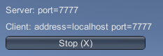
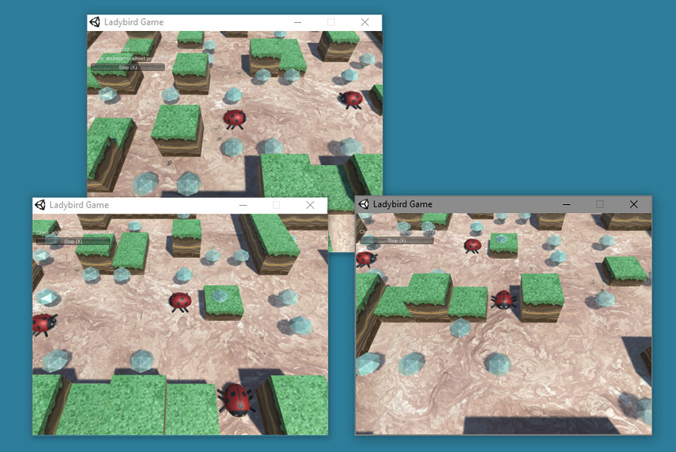
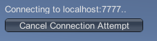

# LAN 模式下的 Network Manager HUD

###LAN Host

单击 **LAN Host** 按钮可将游戏作为本地网络上的主机启动。该客户端既是主机，*也是*游戏中的玩家之一。此情况下使用 Inspector 中的 **Network Info** 部分的信息来托管游戏。

单击此按钮时，HUD 会切换到简单的网络详细信息显示界面，还有一个 **Stop (X)** 按钮，可用于停止托管游戏并返回 LAN 主菜单。

以主机模式开始游戏时，游戏的其他玩家可连接到此主机以加入游戏。

单击 **Stop (X)** 按钮可断开连接到主机玩家的所有玩家。单击 **Stop (X)** 也会将 HUD 返回到 LAN 菜单。

### LAN Client

要连接到本地网络上的主机，请使用 **LAN Client** 按钮右侧的文本字段指定主机的地址。默认主机地址为“localhost”，表示客户端在自己的计算机上查找游戏主机。单击 **LAN Client ****(C)** 可尝试连接到指定的主机地址。

如果在一台计算机上运行多个游戏实例，请使用此字段中的默认“localhost”来测试多人游戏交互情况。为此，可创建游戏的独立构建，然后在计算机上多次启动游戏。这是快速测试网络游戏交互功能是否按预期运行的常用方法（无需将游戏部署到多台计算机或设备）。

如果要在同一网络中（即在 LAN 上）的多台计算机上测试游戏，必须将充当主机的玩家地址输入**“localhost”**文本字段中。

充当主机的玩家需要将 IP 地址告诉运行 LAN 客户端的所有玩家，从而可在文本框中输入该地址。

输入 IP 地址（如果在自己的计算机上进行测试，可将其保留为“localhost”），然后单击 **LAN Client** 尝试连接到主机。

客户端尝试连接时，HUD 会显示 **Cancel Connection Attempt** 按钮。如果要停止尝试连接到主机，请单击此按钮。

如果连接成功，HUD 将显示 **Stop (X)** 按钮。如果要在客户端上停止游戏并断开与主机的连接，请单击此按钮：

Unity 具有内置的 Network Discovery（网络发现）系统，允许客户端在同一本地网络上自动查找主机。但是，此系统未内置于 Network Manager HUD，因此需要手动输入地址。使用自己的 UI 替换 Network Manager HUD 时，可将 Network Discovery 系统集成到游戏中。有关更多信息，请参阅关于 [Network Discovery](UNetDiscovery.html) 的文档。

### LAN Server Only

单击 **LAN Server Only** 可启动游戏并使该游戏充当其他客户端可以连接到的服务器，但不充当游戏本身的客户端。这种类型的游戏通常称为“专用服务器”。用户无法在此特定游戏实例上玩游戏。所有玩家都必须作为客户端连接，没有玩家在作为服务器运行的实例上玩游戏。

在 LAN 上设置一个专用服务器可为所有连接的玩家带来更好的性能，因为除了充当服务器之外，服务器不需要处理本地玩家的游戏运行过程。

有时，您可能希望托管可通过互联网运行的游戏（而不仅仅是在本地网络内），但希望自己保持对服务器的控制，例如，为了防止客户端作弊（因为只有服务器才对游戏具有授权），这种情况下也可以选择这一选项。为此，需要在具有公共 IP 地址的计算机上以 **Server Only** 模式运行游戏。

### Enable Match Maker

单击 **Enable Match Maker (M)** 可将 HUD 更改为 Matchmaker 模式。如果要使用 Unity 的 Matchmaker Multiplayer 服务创建或连接到互联网上托管的游戏，则需要使用 Matchmaker 模式。单击 **Enable Match Maker (M)** 可在 Network Manager HUD 中显示 Matchmaker 控件。

**注意**：请记住，Network Manager HUD 功能是针对开发的临时辅助功能。此组件允许您快速运行多人游戏，但在准备就绪之后应将其替换为您自己的 UI 控件。

