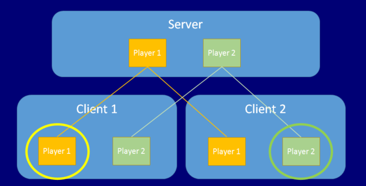

# 玩家游戏对象

Unity 的多玩家 HLAPI 系统对玩家游戏对象的处理方式不同于对非玩家游戏对象的处理方式。当新玩家加入游戏时（当新客户端连接到服务器时），该玩家的游戏对象成为该玩家客户端上的“本地玩家”游戏对象，并且 Unity 将玩家的连接与玩家的游戏对象相关联。Unity 为每个游戏玩家关联一个玩家游戏对象，并将[网络命令](UNetActions.html)路由到这一个游戏对象。一个玩家不能在另一个玩家的游戏对象上调用[命令](UNetActions.html)，只能在自己的游戏对象上调用命令。

NetworkBehaviour 类（从该类可创建网络脚本）具有名为 [isLocalPlayer](../ScriptReference/Networking.NetworkBehaviour-isLocalPlayer.html) 的属性。在每个客户端的玩家游戏对象上，Unity 在 NetworkBehaviour 脚本上将该属性设置为 true，并调用 [OnStartLocalPlayer()](../ScriptReference/Networking.NetworkBehaviour.OnStartLocalPlayer.html) 回调。这意味着每个客户端都像这样设置了一个不同的游戏对象，因为在每个客户端上有一个不同的游戏对象是代表本地玩家的游戏对象。下图显示了两个客户端及其本地玩家。

只有“您自己”的玩家游戏对象（从您的角度看是玩家身份）才能设置 `isLocalPlayer`** **标志。通常，应该在脚本中设置此标志来确定是否处理输入，是否使摄像机跟踪游戏对象，或是否执行仅属于该客户端的玩家的任何其他客户端操作。

玩家游戏对象代表服务器上的玩家（即玩游戏的人），并能够从玩家的客户端上运行命令。这些命令是安全的客户端到服务器[远程过程调用](UNetActions.html)。在此[服务器授权系统](UNetAuthority.html)中，其他非玩家服务器端游戏对象无法直接接收来自客户端游戏对象的命令。这样既是为了安全，也是为了降低构建游戏的复杂性。通过玩家游戏对象来路由用户的所有传入命令，即可确保这些消息来自正确的位置、正确的客户端并可在集中位置进行处理。

每次有客户端连接到服务器时，Network Manager 都会添加一个玩家。但在某些情况下，可能希望在发生输入事件（例如用户在控制器上按“start”按钮）之前不添加玩家。要禁止自动创建玩家，请导航到 Network Manager 组件的 Inspector，然后取消选中 **Auto Create Player** 复选框。
